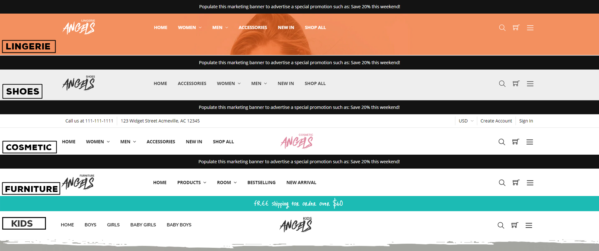
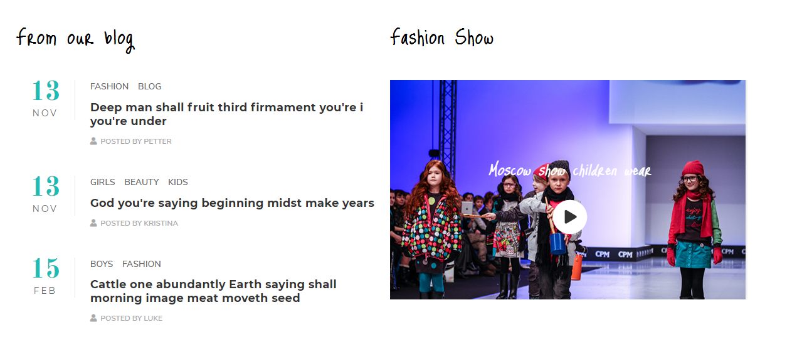

<div ng-app="app">
  <!-- Modal -->
  <div class="modal fade" id="lightbulbs_banner_1" tabindex="-1" role="dialog" aria-labelledby="lightbulbs_banner_1_label">
    <div class="modal-dialog" role="document">
      <div class="modal-content">
        <div class="modal-header">
          <button type="button" class="close" data-dismiss="modal" aria-label="Close"><span aria-hidden="true">&times;</span></button>
          <h4 class="modal-title" id="lightbulbs_banner_1_label">Code Generator: Lightbulbs Banner Style 1</h4>
        </div>
        <div class="modal-body">
          <form>
            <div class="form-group">
              <label for="lightbulbs_banner_1_background_img">Background Image URL:</label>
              <input ng-model="background_img" type="text" class="form-control" id="lightbulbs_banner_1_background_img" ng-init="background_img='//cdn8.bigcommerce.com/s-3qvmac4a37/product_images/uploaded_images/lightbulbs-banner-section-1-bg.jpg'">
            </div>
            <div class="panel-group" id="lightbulbs_banner_1_accordion" role="tablist" aria-multiselectable="true">
              <div class="panel panel-default">
                <div class="panel-heading" role="tab" id="lightbulbs_banner_1_item1_heading">
                  <h4 class="panel-title">
                    <a role="button" data-toggle="collapse" data-parent="#lightbulbs_banner_1_accordion" href="#lightbulbs_banner_1_item1_collapse" aria-expanded="true" aria-controls="lightbulbs_banner_1_item1_collapse">
                      Row 1
                    </a>
                  </h4>
                </div>
                <div id="lightbulbs_banner_1_item1_collapse" class="panel-collapse collapse in" role="tabpanel" aria-labelledby="lightbulbs_banner_1_item1_heading">
                  <div class="panel-body">
                    <div class="form-group">
                      <label for="lightbulbs_banner_1_row1_heading">Heading:</label>
                      <input ng-model="row1_heading" type="text" class="form-control" id="lightbulbs_banner_1_row1_heading" ng-init="row1_heading='Ceiling <br>Lights'">
                    </div>
                    <div class="form-group">
                      <label for="lightbulbs_banner_1_row1_desc">Desc:</label>
                      <input ng-model="row1_desc" type="text" class="form-control" id="lightbulbs_banner_1_row1_desc"
                      ng-init="row1_desc='Add some shine with a ceiling lights!'">
                    </div>
                    <div class="form-group">
                      <label for="lightbulbs_banner_1_row1_link">Button URL:</label>
                      <input ng-model="row1_link" type="text" class="form-control" id="lightbulbs_banner_1_row1_link"
                      ng-init="row1_link='#'">
                    </div>
                    <div class="form-group">
                      <label for="lightbulbs_banner_1_row1_button_text">Button Text:</label>
                      <input ng-model="row1_button_text" type="text" class="form-control" id="lightbulbs_banner_1_row1_button_text"
                      ng-init="row1_button_text='Shop Now'">
                    </div>
                    <div class="form-group">
                      <label for="lightbulbs_banner_1_row1_image_1">Image :</label>
                      <input ng-model="row1_image_1" type="text" class="form-control" id="lightbulbs_banner_1_row1_image_1" ng-init="row1_image_1='//cdn8.bigcommerce.com/s-3qvmac4a37/product_images/uploaded_images/lightbulbs-banner-section-1-1.jpg'">
                    </div>
                    <div class="form-group">
                      <label for="lightbulbs_banner_1_row1_youtube_embed">Youtube Embed:</label>
                      <input ng-model="row1_youtube_embed" type="text" class="form-control" id="lightbulbs_banner_1_row1_youtube_embed" ng-init="row1_youtube_embed='<iframe width=&quot;560&quot; height=&quot;315&quot; src=&quot;https://www.youtube.com/embed/-vtBgNxMyZI&quot; frameborder=&quot;0&quot; allow=&quot;autoplay; encrypted-media&quot; allowfullscreen></iframe>'">
                    </div>
                  </div>
                </div>
              </div>
              <div class="panel panel-default">
                <div class="panel-heading" role="tab" id="lightbulbs_banner_1_item2_heading">
                  <h4 class="panel-title">
                    <a class="collapsed" role="button" data-toggle="collapse" data-parent="#lightbulbs_banner_1_accordion" href="#lightbulbs_banner_1_item2_collapse" aria-expanded="false" aria-controls="lightbulbs_banner_1_item2_collapse">
                      Row 2
                    </a>
                  </h4>
                </div>
                <div id="lightbulbs_banner_1_item2_collapse" class="panel-collapse collapse" role="tabpanel" aria-labelledby="lightbulbs_banner_1_item2_heading">
                  <div class="panel-body">
                    <div class="form-group">
                      <label for="lightbulbs_banner_1_row2_heading">Heading:</label>
                      <input ng-model="row2_heading" type="text" class="form-control" id="lightbulbs_banner_1_row2_heading" ng-init="row2_heading='Floor &amp; <br>Table Lamps'">
                    </div>
                    <div class="form-group">
                      <label for="lightbulbs_banner_1_row2_desc">Desc:</label>
                      <input ng-model="row2_desc" type="text" class="form-control" id="lightbulbs_banner_1_row2_desc"
                      ng-init="row2_desc='Add some shine with a floor lamp!<br> Our modern floor lamps'">
                    </div>
                    <div class="form-group">
                      <label for="lightbulbs_banner_1_row2_link">Button URL:</label>
                      <input ng-model="row2_link" type="text" class="form-control" id="lightbulbs_banner_1_row2_link"
                      ng-init="row2_link='#'">
                    </div>
                    <div class="form-group">
                      <label for="lightbulbs_banner_1_row2_button_text">Button Text:</label>
                      <input ng-model="row2_button_text" type="text" class="form-control" id="lightbulbs_banner_1_row2_button_text"
                      ng-init="row2_button_text='Shop Now'">
                    </div>
                    <div class="form-group">
                      <label for="lightbulbs_banner_1_row2_image_slider_1">Slider Image 1:</label>
                      <input ng-model="row2_image_slider_1" type="text" class="form-control" id="lightbulbs_banner_1_row2_image_slider_1" ng-init="row2_image_slider_1='//cdn8.bigcommerce.com/s-3qvmac4a37/product_images/uploaded_images/lightbulbs-banner-section-1-2.jpg'">
                    </div>
                    <div class="form-group">
                      <label for="lightbulbs_banner_1_row2_link_slider_1">Image 1 URL:</label>
                      <input ng-model="row2_link_slider_1" type="text" class="form-control" id="lightbulbs_banner_1_row2_link_slider_1"
                      ng-init="row2_link_slider_1='#'">
                    </div>
                    <div class="form-group">
                      <label for="lightbulbs_banner_1_row2_image_slider_2">Slider Image 2:</label>
                      <input ng-model="row2_image_slider_2" type="text" class="form-control" id="lightbulbs_banner_1_row2_image_slider_2" ng-init="row2_image_slider_2='//cdn8.bigcommerce.com/s-3qvmac4a37/product_images/uploaded_images/lightbulbs-banner-section-1-3.jpg'">
                    </div>
                    <div class="form-group">
                      <label for="lightbulbs_banner_1_row2_link_slider_2">Image 2 URL:</label>
                      <input ng-model="row2_link_slider_2" type="text" class="form-control" id="lightbulbs_banner_1_row2_link_slider_2"
                      ng-init="row2_link_slider_2='#'">
                    </div>
                    <div class="form-group">
                      <label for="lightbulbs_banner_1_row2_image_slider_3">Slider Image 3:</label>
                      <input ng-model="row2_image_slider_3" type="text" class="form-control" id="lightbulbs_banner_1_row2_image_slider_3" ng-init="row2_image_slider_3='//cdn8.bigcommerce.com/s-3qvmac4a37/product_images/uploaded_images/lightbulbs-banner-section-1-4.jpg'">
                    </div>
                    <div class="form-group">
                      <label for="lightbulbs_banner_1_row2_link_slider_3">Image 3 URL:</label>
                      <input ng-model="row2_link_slider_3" type="text" class="form-control" id="lightbulbs_banner_1_row2_link_slider_3"
                      ng-init="row2_link_slider_3='#'">
                    </div>
                    <div class="form-group">
                      <label for="lightbulbs_banner_1_row2_image_slider_4">Slider Image 4:</label>
                      <input ng-model="row2_image_slider_4" type="text" class="form-control" id="lightbulbs_banner_1_row2_image_slider_4" ng-init="row2_image_slider_4='//cdn8.bigcommerce.com/s-3qvmac4a37/product_images/uploaded_images/lightbulbs-banner-section-1-5.jpg'">
                    </div>
                    <div class="form-group">
                      <label for="lightbulbs_banner_1_row2_link_slider_4">Image 4 URL:</label>
                      <input ng-model="row2_link_slider_4" type="text" class="form-control" id="lightbulbs_banner_1_row2_link_slider_4"
                      ng-init="row2_link_slider_4='#'">
                    </div>
                  </div>
                </div>
              </div>
              <div class="panel panel-default">
                <div class="panel-heading" role="tab" id="lightbulbs_banner_1_item3_heading">
                  <h4 class="panel-title">
                    <a class="collapsed" role="button" data-toggle="collapse" data-parent="#lightbulbs_banner_1_accordion" href="#lightbulbs_banner_1_item3_collapse" aria-expanded="false" aria-controls="lightbulbs_banner_1_item3_collapse">
                      Row 3
                    </a>
                  </h4>
                </div>
                <div id="lightbulbs_banner_1_item3_collapse" class="panel-collapse collapse" role="tabpanel" aria-labelledby="lightbulbs_banner_1_item3_heading">
                  <div class="panel-body">
                    <div class="form-group">
                      <label for="lightbulbs_banner_1_row3_heading">Heading:</label>
                      <input ng-model="row3_heading" type="text" class="form-control" id="lightbulbs_banner_1_row3_heading" ng-init="row3_heading='Wall <br>Lights'">
                    </div>
                    <div class="form-group">
                      <label for="lightbulbs_banner_1_row3_desc">Desc:</label>
                      <input ng-model="row3_desc" type="text" class="form-control" id="lightbulbs_banner_1_row3_desc"
                      ng-init="row3_desc='Add some shine with a ceiling lights!'">
                    </div>
                    <div class="form-group">
                      <label for="lightbulbs_banner_1_row3_link">Button URL:</label>
                      <input ng-model="row3_link" type="text" class="form-control" id="lightbulbs_banner_1_row3_link"
                      ng-init="row3_link='#'">
                    </div>
                    <div class="form-group">
                      <label for="lightbulbs_banner_1_row3_button_text">Button Text:</label>
                      <input ng-model="row3_button_text" type="text" class="form-control" id="lightbulbs_banner_1_row3_button_text"
                      ng-init="row3_button_text='Shop Now'">
                    </div>
                    <div class="form-group">
                      <label for="lightbulbs_banner_1_row3_image_1">Image 1:</label>
                      <input ng-model="row3_image_1" type="text" class="form-control" id="lightbulbs_banner_1_row3_image_1" ng-init="row3_image_1='//cdn8.bigcommerce.com/s-3qvmac4a37/product_images/uploaded_images/lightbulbs-banner-section-1-6.jpg'">
                    </div>
                    <div class="form-group">
                      <label for="lightbulbs_banner_1_row3_image_2">Image 2:</label>
                      <input ng-model="row3_image_2" type="text" class="form-control" id="lightbulbs_banner_1_row3_image_2" ng-init="row3_image_2='//cdn8.bigcommerce.com/s-3qvmac4a37/product_images/uploaded_images/lightbulbs-banner-section-1-7.png'">
                    </div>
                  </div>
                </div>
              </div>
            </div>
            <div hljs include="'/samples/lightbulbs_home_banner1.txt'" compile="true" id="lightbulbs_home_banner1_code" class="highlight-code"></div>
          </form>
        </div>
        <div class="modal-footer">
          <button type="button" class="btn btn-default" data-dismiss="modal">Close</button>
          <button type="button" class="btn btn-primary" data-clipboard-target="#lightbulbs_home_banner1_code">Copy Code</button>
        </div>
      </div>
    </div>
  </div><!-- modal #lightbulbs_banner_1 -->
  <!-- Modal -->
  <div class="modal fade" id="lightbulbs_banner_2" tabindex="-1" role="dialog" aria-labelledby="lightbulbs_banner_2_label">
    <div class="modal-dialog" role="document">
      <div class="modal-content">
        <div class="modal-header">
          <button type="button" class="close" data-dismiss="modal" aria-label="Close"><span aria-hidden="true">&times;</span></button>
          <h4 class="modal-title" id="lightbulbs_banner_2_label">Code Generator: Lightbulbs Banner Style 2</h4>
        </div>
        <div class="modal-body">
          <form>
            <div class="form-group">
              <label for="lightbulbs_banner_2_background_img">Background Image URL:</label>
              <input ng-model="background_img" type="text" class="form-control" id="lightbulbs_banner_2_background_img" ng-init="background_img='//cdn8.bigcommerce.com/s-3qvmac4a37/product_images/uploaded_images/lightbulbs-banner-section-2-bg.jpg'">
            </div>
            <div class="panel-group" id="lightbulbs_banner_2_accordion" role="tablist" aria-multiselectable="true">
              <div class="panel panel-default">
                <div class="panel-heading" role="tab" id="lightbulbs_banner_2_item1_heading">
                  <h4 class="panel-title">
                    <a role="button" data-toggle="collapse" data-parent="#lightbulbs_banner_2_accordion" href="#lightbulbs_banner_2_item1_collapse" aria-expanded="true" aria-controls="lightbulbs_banner_2_item1_collapse">
                      Row 1
                    </a>
                  </h4>
                </div>
                <div id="lightbulbs_banner_2_item1_collapse" class="panel-collapse collapse in" role="tabpanel" aria-labelledby="lightbulbs_banner_2_item1_heading">
                  <div class="panel-body">
                    <div class="form-group">
                      <label for="lightbulbs_banner_2_row1_heading">Heading:</label>
                      <input ng-model="row1_heading" type="text" class="form-control" id="lightbulbs_banner_2_row1_heading" ng-init="row1_heading='LED Light Bulds'">
                    </div>
                    <div class="form-group">
                      <label for="lightbulbs_banner_2_row1_desc">Desc:</label>
                      <input ng-model="row1_desc" type="text" class="form-control" id="lightbulbs_banner_2_row1_desc"
                      ng-init="row1_desc='Add some shine with a LED light! <br>Our modern LED light'">
                    </div>
                    <div class="form-group">
                      <label for="lightbulbs_banner_2_row1_link">Button URL:</label>
                      <input ng-model="row1_link" type="text" class="form-control" id="lightbulbs_banner_2_row1_link"
                      ng-init="row1_link='#'">
                    </div>
                    <div class="form-group">
                      <label for="lightbulbs_banner_2_row1_button_text">Button Text:</label>
                      <input ng-model="row1_button_text" type="text" class="form-control" id="lightbulbs_banner_2_row1_button_text"
                      ng-init="row1_button_text='Shop Now'">
                    </div>
                    <div class="form-group">
                      <label for="lightbulbs_banner_2_row1_image_1">Image :</label>
                      <input ng-model="row1_image_1" type="text" class="form-control" id="lightbulbs_banner_2_row1_image_1" ng-init="row1_image_1='//cdn8.bigcommerce.com/s-3qvmac4a37/product_images/uploaded_images/lightbulbs-banner-section-2-1.gif'">
                    </div>
                  </div>
                </div>
              </div>
              <div class="panel panel-default">
                <div class="panel-heading" role="tab" id="lightbulbs_banner_2_item2_heading">
                  <h4 class="panel-title">
                    <a class="collapsed" role="button" data-toggle="collapse" data-parent="#lightbulbs_banner_2_accordion" href="#lightbulbs_banner_2_item2_collapse" aria-expanded="false" aria-controls="lightbulbs_banner_2_item2_collapse">
                      Row 2
                    </a>
                  </h4>
                </div>
                <div id="lightbulbs_banner_2_item2_collapse" class="panel-collapse collapse" role="tabpanel" aria-labelledby="lightbulbs_banner_2_item2_heading">
                  <div class="panel-body">
                    <div class="form-group">
                      <label for="lightbulbs_banner_2_row2_heading">Heading:</label>
                      <input ng-model="row2_heading" type="text" class="form-control" id="lightbulbs_banner_2_row2_heading" ng-init="row2_heading='Outdoor <br>&amp; Landscape'">
                    </div>
                    <div class="form-group">
                      <label for="lightbulbs_banner_2_row2_desc">Desc:</label>
                      <input ng-model="row2_desc" type="text" class="form-control" id="lightbulbs_banner_2_row2_desc"
                      ng-init="row2_desc='Add some shine with a ceiling lights!'">
                    </div>
                    <div class="form-group">
                      <label for="lightbulbs_banner_2_row2_link">Button URL:</label>
                      <input ng-model="row2_link" type="text" class="form-control" id="lightbulbs_banner_2_row2_link"
                      ng-init="row2_link='#'">
                    </div>
                    <div class="form-group">
                      <label for="lightbulbs_banner_2_row2_button_text">Button Text:</label>
                      <input ng-model="row2_button_text" type="text" class="form-control" id="lightbulbs_banner_2_row2_button_text"
                      ng-init="row2_button_text='Shop Now'">
                    </div>
                    <div class="form-group">
                      <label for="lightbulbs_banner_2_row2_image_1">Image:</label>
                      <input ng-model="row2_image_1" type="text" class="form-control" id="lightbulbs_banner_2_row2_image_1" ng-init="row2_image_1='//cdn8.bigcommerce.com/s-3qvmac4a37/product_images/uploaded_images/lightbulbs-banner-section-2-2.jpg'">
                    </div>
                  </div>
                </div>
              </div>
              <div class="panel panel-default">
                <div class="panel-heading" role="tab" id="lightbulbs_banner_2_item3_heading">
                  <h4 class="panel-title">
                    <a class="collapsed" role="button" data-toggle="collapse" data-parent="#lightbulbs_banner_2_accordion" href="#lightbulbs_banner_2_item3_collapse" aria-expanded="false" aria-controls="lightbulbs_banner_2_item3_collapse">
                      Row 3
                    </a>
                  </h4>
                </div>
                <div id="lightbulbs_banner_2_item3_collapse" class="panel-collapse collapse" role="tabpanel" aria-labelledby="lightbulbs_banner_2_item3_heading">
                  <div class="panel-body">
                    <div class="form-group">
                      <label for="lightbulbs_banner_2_row3_heading">Heading:</label>
                      <input ng-model="row3_heading" type="text" class="form-control" id="lightbulbs_banner_2_row3_heading" ng-init="row3_heading='Lighting Accessories'">
                    </div>
                    <div class="form-group">
                      <label for="lightbulbs_banner_2_row3_desc">Desc:</label>
                      <input ng-model="row3_desc" type="text" class="form-control" id="lightbulbs_banner_2_row3_desc"
                      ng-init="row3_desc='Explore brilliant selection of home lighting hardware and accessories  like light bulbs, lamp adapter kits.'">
                    </div>
                    <div class="form-group">
                      <label for="lightbulbs_banner_2_row3_link">Button URL:</label>
                      <input ng-model="row3_link" type="text" class="form-control" id="lightbulbs_banner_2_row3_link"
                      ng-init="row3_link='#'">
                    </div>
                    <div class="form-group">
                      <label for="lightbulbs_banner_2_row3_button_text">Button Text:</label>
                      <input ng-model="row3_button_text" type="text" class="form-control" id="lightbulbs_banner_2_row3_button_text"
                      ng-init="row3_button_text='Shop Now'">
                    </div>
                    <div class="form-group">
                      <label for="lightbulbs_banner_2_row3_image_slider_1">Slider Image 1:</label>
                      <input ng-model="row3_image_slider_1" type="text" class="form-control" id="lightbulbs_banner_2_row3_image_slider_1" ng-init="row3_image_slider_1='//cdn8.bigcommerce.com/s-3qvmac4a37/product_images/uploaded_images/lightbulbs-banner-section-2-3.jpg'">
                    </div>
                    <div class="form-group">
                      <label for="lightbulbs_banner_2_row3_link_slider_1">Image 1 URL:</label>
                      <input ng-model="row3_link_slider_1" type="text" class="form-control" id="lightbulbs_banner_2_row3_link_slider_1"
                      ng-init="row3_link_slider_1='#'">
                    </div>
                    <div class="form-group">
                      <label for="lightbulbs_banner_2_row3_image_slider_2">Slider Image 2:</label>
                      <input ng-model="row3_image_slider_2" type="text" class="form-control" id="lightbulbs_banner_2_row3_image_slider_2" ng-init="row3_image_slider_2='//cdn8.bigcommerce.com/s-3qvmac4a37/product_images/uploaded_images/lightbulbs-banner-section-2-4.jpg'">
                    </div>
                    <div class="form-group">
                      <label for="lightbulbs_banner_2_row3_link_slider_2">Image 2 URL:</label>
                      <input ng-model="row3_link_slider_2" type="text" class="form-control" id="lightbulbs_banner_2_row3_link_slider_2"
                      ng-init="row3_link_slider_2='#'">
                    </div>
                    <div class="form-group">
                      <label for="lightbulbs_banner_2_row3_image_slider_3">Slider Image 3:</label>
                      <input ng-model="row3_image_slider_3" type="text" class="form-control" id="lightbulbs_banner_2_row3_image_slider_3" ng-init="row3_image_slider_3='//cdn8.bigcommerce.com/s-3qvmac4a37/product_images/uploaded_images/lightbulbs-banner-section-2-5.jpg'">
                    </div>
                    <div class="form-group">
                      <label for="lightbulbs_banner_2_row3_link_slider_3">Image 3 URL:</label>
                      <input ng-model="row3_link_slider_3" type="text" class="form-control" id="lightbulbs_banner_2_row3_link_slider_3"
                      ng-init="row3_link_slider_3='#'">
                    </div>
                    <div class="form-group">
                      <label for="lightbulbs_banner_2_row3_image_slider_4">Slider Image 4:</label>
                      <input ng-model="row3_image_slider_4" type="text" class="form-control" id="lightbulbs_banner_2_row3_image_slider_4" ng-init="row3_image_slider_4='//cdn8.bigcommerce.com/s-3qvmac4a37/product_images/uploaded_images/lightbulbs-banner-section-2-6.jpg'">
                    </div>
                    <div class="form-group">
                      <label for="lightbulbs_banner_2_row3_link_slider_4">Image 4 URL:</label>
                      <input ng-model="row3_link_slider_4" type="text" class="form-control" id="lightbulbs_banner_2_row3_link_slider_4"
                      ng-init="row3_link_slider_4='#'">
                    </div>
                  </div>
                </div>
              </div>
            </div>
            <div hljs include="'/samples/lightbulbs_home_banner2.txt'" compile="true" id="lightbulbs_home_banner2_code" class="highlight-code"></div>
          </form>
        </div>
        <div class="modal-footer">
          <button type="button" class="btn btn-default" data-dismiss="modal">Close</button>
          <button type="button" class="btn btn-primary" data-clipboard-target="#lightbulbs_home_banner2_code">Copy Code</button>
        </div>
      </div>
    </div>
  </div><!-- modal #lightbulbs_banner_2 -->
  <!-- Modal -->
  <div class="modal fade" id="chiara_home_banner1_modal" tabindex="-1" role="dialog" aria-labelledby="chiara_home_banner1_modal_label">
    <div class="modal-dialog" role="document">
      <div class="modal-content">
        <div class="modal-header">
          <button type="button" class="close" data-dismiss="modal" aria-label="Close"><span aria-hidden="true">&times;</span></button>
          <h4 class="modal-title" id="chiara_home_banner1_modal_label">Code Generator: Homepage 5 Banners</h4>
        </div>
        <div class="modal-body">
          <form>
            <div class="panel-group" id="chiara_home_banner1_accordion" role="tablist" aria-multiselectable="true">
              <div class="panel panel-default">
                <div class="panel-heading" role="tab" id="chiara_home_banner1_item1_heading">
                  <h4 class="panel-title">
                    <a role="button" data-toggle="collapse" data-parent="#chiara_home_banner1_accordion" href="#chiara_home_banner1_item1_collapse" aria-expanded="true" aria-controls="chiara_home_banner1_item1_collapse">
                      Banner 1
                    </a>
                  </h4>
                </div>
                <div id="chiara_home_banner1_item1_collapse" class="panel-collapse collapse in" role="tabpanel" aria-labelledby="chiara_home_banner1_item1_heading">
                  <div class="panel-body">
                    <div class="form-group">
                      <label for="chiara_home_banner1_item1_img_bg">Background Image URL:</label>
                      <input ng-model="item1_img_bg" type="text" class="form-control" id="chiara_home_banner1_item1_img_bg" ng-init="item1_img_bg='https://cdn7.bigcommerce.com/s-g0pakqdzwl/product_images/uploaded_images/furniture-banner1.jpg?t=1534872898'">
                    </div>
                    <div class="form-group">
                      <label for="chiara_home_banner1_item1_img_fg">Front Image URL:</label>
                      <input ng-model="item1_img_fg" type="text" class="form-control" id="chiara_home_banner1_item1_img_fg" ng-init="item1_img_fg='https://cdn7.bigcommerce.com/s-g0pakqdzwl/product_images/uploaded_images/furniture-banner1a.png?t=1534872899'">
                    </div>
                    <div class="form-group">
                      <label for="chiara_home_banner1_item1_alt">Image Alt:</label>
                      <input ng-model="item1_alt" type="text" class="form-control" id="chiara_home_banner1_item1_alt">
                    </div>
                    <div class="form-group">
                      <label for="chiara_home_banner1_item1_link">Link URL:</label>
                      <input ng-model="item1_link" type="text" class="form-control" id="chiara_home_banner1_item1_link">
                    </div>
                  </div>
                </div>
              </div>
              <div class="panel panel-default">
                <div class="panel-heading" role="tab" id="chiara_home_banner1_item2_heading">
                  <h4 class="panel-title">
                    <a class="collapsed" role="button" data-toggle="collapse" data-parent="#chiara_home_banner1_accordion" href="#chiara_home_banner1_item2_collapse" aria-expanded="false" aria-controls="chiara_home_banner1_item2_collapse">
                      Banner 2
                    </a>
                  </h4>
                </div>
                <div id="chiara_home_banner1_item2_collapse" class="panel-collapse collapse" role="tabpanel" aria-labelledby="chiara_home_banner1_item2_heading">
                  <div class="panel-body">
                    <div class="form-group">
                      <label for="chiara_home_banner1_item2_img_bg">Background Image URL:</label>
                      <input ng-model="item2_img_bg" type="text" class="form-control" id="chiara_home_banner1_item2_img_bg" ng-init="item2_img_bg='https://cdn7.bigcommerce.com/s-g0pakqdzwl/product_images/uploaded_images/furniture-banner2.jpg?t=1534872900'">
                    </div>
                    <div class="form-group">
                      <label for="chiara_home_banner1_item2_img_fg">Front Image URL:</label>
                      <input ng-model="item2_img_fg" type="text" class="form-control" id="chiara_home_banner1_item2_img_fg" ng-init="item2_img_fg='https://cdn7.bigcommerce.com/s-g0pakqdzwl/product_images/uploaded_images/furniture-banner2a.png?t=1534872900'">
                    </div>
                    <div class="form-group">
                      <label for="chiara_home_banner1_item2_alt">Image Alt:</label>
                      <input ng-model="item2_alt" type="text" class="form-control" id="chiara_home_banner1_item2_alt">
                    </div>
                    <div class="form-group">
                      <label for="chiara_home_banner1_item2_link">Link URL:</label>
                      <input ng-model="item2_link" type="text" class="form-control" id="chiara_home_banner1_item2_link">
                    </div>
                  </div>
                </div>
              </div>
              <div class="panel panel-default">
                <div class="panel-heading" role="tab" id="chiara_home_banner1_item3_heading">
                  <h4 class="panel-title">
                    <a class="collapsed" role="button" data-toggle="collapse" data-parent="#chiara_home_banner1_accordion" href="#chiara_home_banner1_item3_collapse" aria-expanded="false" aria-controls="chiara_home_banner1_item3_collapse">
                      Banner 3
                    </a>
                  </h4>
                </div>
                <div id="chiara_home_banner1_item3_collapse" class="panel-collapse collapse" role="tabpanel" aria-labelledby="chiara_home_banner1_item3_heading">
                  <div class="panel-body">
                    <div class="form-group">
                      <label for="chiara_home_banner1_item3_img_bg">Background Image URL:</label>
                      <input ng-model="item3_img_bg" type="text" class="form-control" id="chiara_home_banner1_item3_img_bg" ng-init="item3_img_bg='https://cdn7.bigcommerce.com/s-g0pakqdzwl/product_images/uploaded_images/furniture-banner2.jpg?t=1534872900'">
                    </div>
                    <div class="form-group">
                      <label for="chiara_home_banner1_item3_img_fg">Front Image URL:</label>
                      <input ng-model="item3_img_fg" type="text" class="form-control" id="chiara_home_banner1_item3_img_fg" ng-init="item3_img_fg='https://cdn7.bigcommerce.com/s-g0pakqdzwl/product_images/uploaded_images/furniture-banner2a.png?t=1534872900'">
                    </div>
                    <div class="form-group">
                      <label for="chiara_home_banner1_item3_alt">Image Alt:</label>
                      <input ng-model="item3_alt" type="text" class="form-control" id="chiara_home_banner1_item3_alt">
                    </div>
                    <div class="form-group">
                      <label for="chiara_home_banner1_item3_link">Link URL:</label>
                      <input ng-model="item3_link" type="text" class="form-control" id="chiara_home_banner1_item3_link">
                    </div>
                  </div>
                </div>
              </div>
              <div class="panel panel-default">
                <div class="panel-heading" role="tab" id="chiara_home_banner1_item4_heading">
                  <h4 class="panel-title">
                    <a class="collapsed" role="button" data-toggle="collapse" data-parent="#chiara_home_banner1_accordion" href="#chiara_home_banner1_item4_collapse" aria-expanded="false" aria-controls="chiara_home_banner1_item4_collapse">
                      Banner 4
                    </a>
                  </h4>
                </div>
                <div id="chiara_home_banner1_item4_collapse" class="panel-collapse collapse" role="tabpanel" aria-labelledby="chiara_home_banner1_item4_heading">
                  <div class="panel-body">
                    <div class="form-group">
                      <label for="chiara_home_banner1_item4_img_bg">Background Image URL:</label>
                      <input ng-model="item4_img_bg" type="text" class="form-control" id="chiara_home_banner1_item4_img_bg" ng-init="item4_img_bg='https://cdn7.bigcommerce.com/s-g0pakqdzwl/product_images/uploaded_images/furniture-banner2.jpg?t=1534872900'">
                    </div>
                    <div class="form-group">
                      <label for="chiara_home_banner1_item4_img_fg">Front Image URL:</label>
                      <input ng-model="item4_img_fg" type="text" class="form-control" id="chiara_home_banner1_item4_img_fg" ng-init="item4_img_fg='https://cdn7.bigcommerce.com/s-g0pakqdzwl/product_images/uploaded_images/furniture-banner2a.png?t=1534872900'">
                    </div>
                    <div class="form-group">
                      <label for="chiara_home_banner1_item4_alt">Image Alt:</label>
                      <input ng-model="item4_alt" type="text" class="form-control" id="chiara_home_banner1_item4_alt">
                    </div>
                    <div class="form-group">
                      <label for="chiara_home_banner1_item4_link">Link URL:</label>
                      <input ng-model="item4_link" type="text" class="form-control" id="chiara_home_banner1_item4_link">
                    </div>
                  </div>
                </div>
              </div>
              <div class="panel panel-default">
                <div class="panel-heading" role="tab" id="chiara_home_banner1_item5_heading">
                  <h4 class="panel-title">
                    <a class="collapsed" role="button" data-toggle="collapse" data-parent="#chiara_home_banner1_accordion" href="#chiara_home_banner1_item5_collapse" aria-expanded="false" aria-controls="chiara_home_banner1_item5_collapse">
                      Banner 5
                    </a>
                  </h4>
                </div>
                <div id="chiara_home_banner1_item5_collapse" class="panel-collapse collapse" role="tabpanel" aria-labelledby="chiara_home_banner1_item5_heading">
                  <div class="panel-body">
                    <div class="form-group">
                      <label for="chiara_home_banner1_item5_img_bg">Background Image URL:</label>
                      <input ng-model="item5_img_bg" type="text" class="form-control" id="chiara_home_banner1_item5_img_bg" ng-init="item5_img_bg='https://cdn7.bigcommerce.com/s-g0pakqdzwl/product_images/uploaded_images/furniture-banner2.jpg?t=1534872900'">
                    </div>
                    <div class="form-group">
                      <label for="chiara_home_banner1_item5_img_fg">Front Image URL:</label>
                      <input ng-model="item5_img_fg" type="text" class="form-control" id="chiara_home_banner1_item5_img_fg" ng-init="item5_img_fg='https://cdn7.bigcommerce.com/s-g0pakqdzwl/product_images/uploaded_images/furniture-banner2a.png?t=1534872900'">
                    </div>
                    <div class="form-group">
                      <label for="chiara_home_banner1_item5_alt">Image Alt:</label>
                      <input ng-model="item5_alt" type="text" class="form-control" id="chiara_home_banner1_item5_alt">
                    </div>
                    <div class="form-group">
                      <label for="chiara_home_banner1_item5_link">Link URL:</label>
                      <input ng-model="item5_link" type="text" class="form-control" id="chiara_home_banner1_item5_link">
                    </div>
                  </div>
                </div>
              </div>
            </div>
            <div hljs include="'/samples/chiara_home_banner1.txt'" compile="true" id="chiara_home_banner1_code" class="highlight-code"></div>
          </form>
        </div>
        <div class="modal-footer">
          <button type="button" class="btn btn-default" data-dismiss="modal">Close</button>
          <button type="button" class="btn btn-primary" data-clipboard-target="#chiara_home_banner1_code">Copy Code</button>
        </div>
      </div>
    </div>
  </div><!-- modal #chiara_home_banner1_modal -->
  <!-- Modal -->
  <div class="modal fade" id="chiara_home_banner2_modal" tabindex="-1" role="dialog" aria-labelledby="chiara_home_banner2_modal_label">
    <div class="modal-dialog" role="document">
      <div class="modal-content">
        <div class="modal-header">
          <button type="button" class="close" data-dismiss="modal" aria-label="Close"><span aria-hidden="true">&times;</span></button>
          <h4 class="modal-title" id="chiara_home_banner2_modal_label">Code Generator: Homepage Fullwidth Banner</h4>
        </div>
        <div class="modal-body">
          <form>
            <div class="panel-group" id="chiara_home_banner2_accordion" role="tablist" aria-multiselectable="true">
              <div class="panel panel-default">
                <div class="panel-heading" role="tab" id="chiara_home_banner2_item1_heading">
                  <h4 class="panel-title">
                    <a role="button" data-toggle="collapse" data-parent="#chiara_home_banner2_accordion" href="#chiara_home_banner2_item1_collapse" aria-expanded="true" aria-controls="chiara_home_banner2_item1_collapse">
                      Banner
                    </a>
                  </h4>
                </div>
                <div id="chiara_home_banner2_item1_collapse" class="panel-collapse collapse in" role="tabpanel" aria-labelledby="chiara_home_banner2_item1_heading">
                  <div class="panel-body">
                    <div class="form-group">
                      <label for="chiara_home_banner2_item1_img_bg">Background Image URL:</label>
                      <input ng-model="item1_img_bg" type="text" class="form-control" id="chiara_home_banner2_item1_img_bg" ng-init="item1_img_bg='https://cdn7.bigcommerce.com/s-g0pakqdzwl/product_images/uploaded_images/furniture-banner6.jpg?t=1534874551'">
                    </div>
                    <div class="form-group">
                      <label for="chiara_home_banner2_item1_img_fg">Front Image URL:</label>
                      <input ng-model="item1_img_fg" type="text" class="form-control" id="chiara_home_banner2_item1_img_fg" ng-init="item1_img_fg='https://cdn7.bigcommerce.com/s-g0pakqdzwl/product_images/uploaded_images/furniture-banner6a.png?t=1534874552'">
                    </div>
                    <div class="form-group">
                      <label for="chiara_home_banner2_item1_alt">Image Alt:</label>
                      <input ng-model="item1_alt" type="text" class="form-control" id="chiara_home_banner2_item1_alt">
                    </div>
                    <div class="form-group">
                      <label for="chiara_home_banner2_item1_link">Link URL:</label>
                      <input ng-model="item1_link" type="text" class="form-control" id="chiara_home_banner2_item1_link">
                    </div>
                  </div>
                </div>
              </div>
            </div>
            <div hljs include="'/samples/chiara_home_banner2.txt'" compile="true" id="chiara_home_banner2_code" class="highlight-code"></div>
          </form>
        </div>
        <div class="modal-footer">
          <button type="button" class="btn btn-default" data-dismiss="modal">Close</button>
          <button type="button" class="btn btn-primary" data-clipboard-target="#chiara_home_banner2_code">Copy Code</button>
        </div>
      </div>
    </div>
  </div><!-- modal #chiara_home_banner2_modal -->
  <!-- Modal -->
  <div class="modal fade" id="chiara_home_banner3_modal" tabindex="-1" role="dialog" aria-labelledby="chiara_home_banner3_modal_label">
    <div class="modal-dialog" role="document">
      <div class="modal-content">
        <div class="modal-header">
          <button type="button" class="close" data-dismiss="modal" aria-label="Close"><span aria-hidden="true">&times;</span></button>
          <h4 class="modal-title" id="chiara_home_banner3_modal_label">Code Generator: Images Carousel</h4>
        </div>
        <div class="modal-body">
          <form>
            <div class="panel-group" id="chiara_home_banner3_accordion" role="tablist" aria-multiselectable="true">
              <div class="panel panel-default">
                <div class="panel-heading" role="tab" id="chiara_home_banner3_item1_heading">
                  <h4 class="panel-title">
                    <a role="button" data-toggle="collapse" data-parent="#chiara_home_banner3_accordion" href="#chiara_home_banner3_item1_collapse" aria-expanded="true" aria-controls="chiara_home_banner3_item1_collapse">
                      Image 1
                    </a>
                  </h4>
                </div>
                <div id="chiara_home_banner3_item1_collapse" class="panel-collapse collapse in" role="tabpanel" aria-labelledby="chiara_home_banner3_item1_heading">
                  <div class="panel-body">
                    <div class="form-group">
                      <label for="chiara_home_banner3_item1_img">Background Image URL:</label>
                      <input ng-model="item1_img" type="text" class="form-control" id="chiara_home_banner3_item1_img" ng-init="item1_img='https://cdn8.bigcommerce.com/s-o0llnqp9lx/product_images/uploaded_images/brand1.jpg'">
                    </div>
                    <div class="form-group">
                      <label for="chiara_home_banner3_item1_alt">Image Alt:</label>
                      <input ng-model="item1_alt" type="text" class="form-control" id="chiara_home_banner3_item1_alt"
                      ng-init="item1_alt='Banner1'">
                    </div>
                    <div class="form-group">
                      <label for="chiara_home_banner3_item1_link">Link URL:</label>
                      <input ng-model="item1_link" type="text" class="form-control" id="chiara_home_banner3_item1_link"
                      ng-init="item1_link='#'">
                    </div>
                  </div>
                </div>
              </div>
              <div class="panel panel-default">
                <div class="panel-heading" role="tab" id="chiara_home_banner3_item2_heading">
                  <h4 class="panel-title">
                    <a class="collapsed" role="button" data-toggle="collapse" data-parent="#chiara_home_banner3_accordion" href="#chiara_home_banner3_item2_collapse" aria-expanded="false" aria-controls="chiara_home_banner3_item2_collapse">
                      Image 2
                    </a>
                  </h4>
                </div>
                <div id="chiara_home_banner3_item2_collapse" class="panel-collapse collapse" role="tabpanel" aria-labelledby="chiara_home_banner3_item2_heading">
                  <div class="panel-body">
                    <div class="form-group">
                      <label for="chiara_home_banner3_item2_img">Background Image URL:</label>
                      <input ng-model="item2_img" type="text" class="form-control" id="chiara_home_banner3_item2_img" ng-init="item2_img='https://cdn8.bigcommerce.com/s-o0llnqp9lx/product_images/uploaded_images/brand2.jpg'">
                    </div>
                    <div class="form-group">
                      <label for="chiara_home_banner3_item2_alt">Image Alt:</label>
                      <input ng-model="item2_alt" type="text" class="form-control" id="chiara_home_banner3_item2_alt"
                      ng-init="item2_alt='Banner2'">
                    </div>
                    <div class="form-group">
                      <label for="chiara_home_banner3_item2_link">Link URL:</label>
                      <input ng-model="item2_link" type="text" class="form-control" id="chiara_home_banner3_item2_link"
                      ng-init="item2_link='#'">
                    </div>
                  </div>
                </div>
              </div>
              <div class="panel panel-default">
                <div class="panel-heading" role="tab" id="chiara_home_banner3_item3_heading">
                  <h4 class="panel-title">
                    <a class="collapsed" role="button" data-toggle="collapse" data-parent="#chiara_home_banner3_accordion" href="#chiara_home_banner3_item3_collapse" aria-expanded="false" aria-controls="chiara_home_banner3_item3_collapse">
                      Image 3
                    </a>
                  </h4>
                </div>
                <div id="chiara_home_banner3_item3_collapse" class="panel-collapse collapse" role="tabpanel" aria-labelledby="chiara_home_banner3_item3_heading">
                  <div class="panel-body">
                    <div class="form-group">
                      <label for="chiara_home_banner3_item3_img">Background Image URL:</label>
                      <input ng-model="item3_img" type="text" class="form-control" id="chiara_home_banner3_item3_img" ng-init="item3_img='https://cdn8.bigcommerce.com/s-o0llnqp9lx/product_images/uploaded_images/brand3.jpg'">
                    </div>
                    <div class="form-group">
                      <label for="chiara_home_banner3_item3_alt">Image Alt:</label>
                      <input ng-model="item3_alt" type="text" class="form-control" id="chiara_home_banner3_item3_alt"
                      ng-init="item3_alt='Banner3'">
                    </div>
                    <div class="form-group">
                      <label for="chiara_home_banner3_item3_link">Link URL:</label>
                      <input ng-model="item3_link" type="text" class="form-control" id="chiara_home_banner3_item3_link"
                      ng-init="item3_link='#'">
                    </div>
                  </div>
                </div>
              </div>
              <div class="panel panel-default">
                <div class="panel-heading" role="tab" id="chiara_home_banner3_item4_heading">
                  <h4 class="panel-title">
                    <a class="collapsed" role="button" data-toggle="collapse" data-parent="#chiara_home_banner3_accordion" href="#chiara_home_banner3_item4_collapse" aria-expanded="false" aria-controls="chiara_home_banner3_item4_collapse">
                      Image 4
                    </a>
                  </h4>
                </div>
                <div id="chiara_home_banner3_item4_collapse" class="panel-collapse collapse" role="tabpanel" aria-labelledby="chiara_home_banner3_item4_heading">
                  <div class="panel-body">
                    <div class="form-group">
                      <label for="chiara_home_banner3_item4_img">Background Image URL:</label>
                      <input ng-model="item4_img" type="text" class="form-control" id="chiara_home_banner3_item4_img" ng-init="item4_img='https://cdn8.bigcommerce.com/s-o0llnqp9lx/product_images/uploaded_images/brand4.jpg'">
                    </div>
                    <div class="form-group">
                      <label for="chiara_home_banner3_item4_alt">Image Alt:</label>
                      <input ng-model="item4_alt" type="text" class="form-control" id="chiara_home_banner3_item4_alt"
                      ng-init="item4_alt='Banner4'">
                    </div>
                    <div class="form-group">
                      <label for="chiara_home_banner3_item4_link">Link URL:</label>
                      <input ng-model="item4_link" type="text" class="form-control" id="chiara_home_banner3_item4_link"
                      ng-init="item4_link='#'">
                    </div>
                  </div>
                </div>
              </div>
              <div class="panel panel-default">
                <div class="panel-heading" role="tab" id="chiara_home_banner3_item5_heading">
                  <h4 class="panel-title">
                    <a class="collapsed" role="button" data-toggle="collapse" data-parent="#chiara_home_banner3_accordion" href="#chiara_home_banner3_item5_collapse" aria-expanded="false" aria-controls="chiara_home_banner3_item5_collapse">
                      Image 5
                    </a>
                  </h4>
                </div>
                <div id="chiara_home_banner3_item5_collapse" class="panel-collapse collapse" role="tabpanel" aria-labelledby="chiara_home_banner3_item5_heading">
                  <div class="panel-body">
                    <div class="form-group">
                      <label for="chiara_home_banner3_item5_img">Background Image URL:</label>
                      <input ng-model="item5_img" type="text" class="form-control" id="chiara_home_banner3_item5_img" ng-init="item5_img='https://cdn8.bigcommerce.com/s-o0llnqp9lx/product_images/uploaded_images/brand5.jpg'">
                    </div>
                    <div class="form-group">
                      <label for="chiara_home_banner3_item5_alt">Image Alt:</label>
                      <input ng-model="item5_alt" type="text" class="form-control" id="chiara_home_banner3_item5_alt"
                      ng-init="item5_alt='Banner5'">
                    </div>
                    <div class="form-group">
                      <label for="chiara_home_banner3_item5_link">Link URL:</label>
                      <input ng-model="item5_link" type="text" class="form-control" id="chiara_home_banner3_item5_link"
                      ng-init="item5_link='#'">
                    </div>
                  </div>
                </div>
              </div>
              <div class="panel panel-default">
                <div class="panel-heading" role="tab" id="chiara_home_banner3_item6_heading">
                  <h4 class="panel-title">
                    <a class="collapsed" role="button" data-toggle="collapse" data-parent="#chiara_home_banner3_accordion" href="#chiara_home_banner3_item6_collapse" aria-expanded="false" aria-controls="chiara_home_banner3_item6_collapse">
                      Image 6
                    </a>
                  </h4>
                </div>
                <div id="chiara_home_banner3_item6_collapse" class="panel-collapse collapse" role="tabpanel" aria-labelledby="chiara_home_banner3_item6_heading">
                  <div class="panel-body">
                    <div class="form-group">
                      <label for="chiara_home_banner3_item6_img">Background Image URL:</label>
                      <input ng-model="item6_img" type="text" class="form-control" id="chiara_home_banner3_item6_img" ng-init="item6_img='https://cdn8.bigcommerce.com/s-o0llnqp9lx/product_images/uploaded_images/brand6.jpg'">
                    </div>
                    <div class="form-group">
                      <label for="chiara_home_banner3_item6_alt">Image Alt:</label>
                      <input ng-model="item6_alt" type="text" class="form-control" id="chiara_home_banner3_item6_alt"
                      ng-init="item6_alt='Banner6'">
                    </div>
                    <div class="form-group">
                      <label for="chiara_home_banner3_item6_link">Link URL:</label>
                      <input ng-model="item6_link" type="text" class="form-control" id="chiara_home_banner3_item6_link"
                      ng-init="item6_link='#'">
                    </div>
                  </div>
                </div>
              </div>
              <div class="panel panel-default">
                <div class="panel-heading" role="tab" id="chiara_home_banner3_item7_heading">
                  <h4 class="panel-title">
                    <a class="collapsed" role="button" data-toggle="collapse" data-parent="#chiara_home_banner3_accordion" href="#chiara_home_banner3_item7_collapse" aria-expanded="false" aria-controls="chiara_home_banner3_item7_collapse">
                      Image 7
                    </a>
                  </h4>
                </div>
                <div id="chiara_home_banner3_item7_collapse" class="panel-collapse collapse" role="tabpanel" aria-labelledby="chiara_home_banner3_item7_heading">
                  <div class="panel-body">
                    <div class="form-group">
                      <label for="chiara_home_banner3_item7_img">Background Image URL:</label>
                      <input ng-model="item7_img" type="text" class="form-control" id="chiara_home_banner3_item7_img" ng-init="item7_img='https://cdn8.bigcommerce.com/s-o0llnqp9lx/product_images/uploaded_images/brand7.jpg'">
                    </div>
                    <div class="form-group">
                      <label for="chiara_home_banner3_item7_alt">Image Alt:</label>
                      <input ng-model="item7_alt" type="text" class="form-control" id="chiara_home_banner3_item7_alt"
                      ng-init="item7_alt='Banner7'">
                    </div>
                    <div class="form-group">
                      <label for="chiara_home_banner3_item7_link">Link URL:</label>
                      <input ng-model="item7_link" type="text" class="form-control" id="chiara_home_banner3_item7_link"
                      ng-init="item7_link='#'">
                    </div>
                  </div>
                </div>
              </div>
              <div class="panel panel-default">
                <div class="panel-heading" role="tab" id="chiara_home_banner3_item8_heading">
                  <h4 class="panel-title">
                    <a class="collapsed" role="button" data-toggle="collapse" data-parent="#chiara_home_banner3_accordion" href="#chiara_home_banner3_item8_collapse" aria-expanded="false" aria-controls="chiara_home_banner3_item8_collapse">
                      Image 8
                    </a>
                  </h4>
                </div>
                <div id="chiara_home_banner3_item8_collapse" class="panel-collapse collapse" role="tabpanel" aria-labelledby="chiara_home_banner3_item8_heading">
                  <div class="panel-body">
                    <div class="form-group">
                      <label for="chiara_home_banner3_item8_img">Background Image URL:</label>
                      <input ng-model="item8_img" type="text" class="form-control" id="chiara_home_banner3_item8_img" ng-init="item8_img='https://cdn8.bigcommerce.com/s-o0llnqp9lx/product_images/uploaded_images/brand8.jpg'">
                    </div>
                    <div class="form-group">
                      <label for="chiara_home_banner3_item8_alt">Image Alt:</label>
                      <input ng-model="item8_alt" type="text" class="form-control" id="chiara_home_banner3_item8_alt"
                      ng-init="item8_alt='Banner8'">
                    </div>
                    <div class="form-group">
                      <label for="chiara_home_banner3_item8_link">Link URL:</label>
                      <input ng-model="item8_link" type="text" class="form-control" id="chiara_home_banner3_item8_link"
                      ng-init="item8_link='#'">
                    </div>
                  </div>
                </div>
              </div>
            </div>
            <div hljs include="'/samples/chiara_home_banner3.txt'" compile="true" id="chiara_home_banner3_code" class="highlight-code"></div>
          </form>
        </div>
        <div class="modal-footer">
          <button type="button" class="btn btn-default" data-dismiss="modal">Close</button>
          <button type="button" class="btn btn-primary" data-clipboard-target="#chiara_home_banner3_code">Copy Code</button>
        </div>
      </div>
    </div>
  </div><!-- modal #chiara_home_banner3_modal -->
  <!-- Modal -->
  <div class="modal fade" id="chiara_sidebar_category_banner1_modal" tabindex="-1" role="dialog" aria-labelledby="chiara_sidebar_category_banner1_modal_label">
    <div class="modal-dialog" role="document">
      <div class="modal-content">
        <div class="modal-header">
          <button type="button" class="close" data-dismiss="modal" aria-label="Close"><span aria-hidden="true">&times;</span></button>
          <h4 class="modal-title" id="chiara_sidebar_category_banner1_modal_label">Code Generator: Sidebar Category Banner 1</h4>
        </div>
        <div class="modal-body">
          <form>
            <div class="panel-group" id="chiara_sidebar_category_banner1_accordion" role="tablist" aria-multiselectable="true">
              <div class="panel panel-default">
                <div class="panel-heading" role="tab" id="chiara_sidebar_category_banner1_item1_heading">
                  <h4 class="panel-title">
                    <a role="button" data-toggle="collapse" data-parent="#chiara_sidebar_category_banner1_accordion" href="#chiara_sidebar_category_banner1_item1_collapse" aria-expanded="true" aria-controls="chiara_sidebar_category_banner1_item1_collapse">
                      Image
                    </a>
                  </h4>
                </div>
                <div id="chiara_sidebar_category_banner1_item1_collapse" class="panel-collapse collapse in" role="tabpanel" aria-labelledby="chiara_sidebar_category_banner1_item1_heading">
                  <div class="panel-body">
                    <div class="form-group">
                      <label for="chiara_sidebar_category_banner1_item1_img">Image URL:</label>
                      <input ng-model="item1_img" type="text" class="form-control" id="chiara_sidebar_category_banner1_item1_img" ng-init="item1_img='https://cdn8.bigcommerce.com/s-o0llnqp9lx/product_images/uploaded_images/banner-sidebar.jpg'">
                    </div>
                    <div class="form-group">
                      <label for="chiara_sidebar_category_banner1_item1_alt">Image Alt:</label>
                      <input ng-model="item1_alt" type="text" class="form-control" id="chiara_sidebar_category_banner1_item1_alt"
                      ng-init="item1_title='beauty'">
                    </div>
                    <div class="form-group">
                      <label for="chiara_sidebar_category_banner1_item1_link">Title:</label>
                      <input ng-model="item1_title" type="text" class="form-control" id="chiara_sidebar_category_banner1_item1_title"
                      ng-init="item1_title='beauty'">
                    </div>
                    <div class="form-group">
                      <label for="chiara_sidebar_category_banner1_item1_link">Subtitle:</label>
                      <input ng-model="item1_subtitle" type="text" class="form-control" id="chiara_sidebar_category_banner1_item1_subtitle"
                      ng-init="item1_subtitle='from &pound;29.99'">
                    </div>
                    <div class="form-group">
                      <label for="chiara_sidebar_category_banner1_item1_link">Link URL:</label>
                      <input ng-model="item1_action_link" type="text" class="form-control" id="chiara_sidebar_category_banner1_item1_link"
                      ng-init="item1_action_link='#'">
                    </div>
                    <div class="form-group">
                      <label for="chiara_sidebar_category_banner1_item1_link">Link Text:</label>
                      <input ng-model="item1_action_text" type="text" class="form-control" id="chiara_sidebar_category_banner1_item1_link"
                      ng-init="item1_action_text='shop now'">
                    </div>
                  </div>
                </div>
              </div>
            </div>
            <div hljs include="'/samples/chiara_sidebar_category_banner1.txt'" compile="true" id="chiara_sidebar_category_banner1_code" class="highlight-code"></div>
          </form>
        </div>
        <div class="modal-footer">
          <button type="button" class="btn btn-default" data-dismiss="modal">Close</button>
          <button type="button" class="btn btn-primary" data-clipboard-target="#chiara_sidebar_category_banner1_code">Copy Code</button>
        </div>
      </div>
    </div>
  </div><!-- modal #chiara_sidebar_category_banner1_modal -->
  <!-- Modal -->
  <div class="modal fade" id="chiara_sidebar_category_banner2_modal" tabindex="-1" role="dialog" aria-labelledby="chiara_sidebar_category_banner2_modal_label">
    <div class="modal-dialog" role="document">
      <div class="modal-content">
        <div class="modal-header">
          <button type="button" class="close" data-dismiss="modal" aria-label="Close"><span aria-hidden="true">&times;</span></button>
          <h4 class="modal-title" id="chiara_sidebar_category_banner2_modal_label">Code Generator: Sidebar Category Banner 2</h4>
        </div>
        <div class="modal-body">
          <form>
            <div class="panel-group" id="chiara_sidebar_category_banner2_accordion" role="tablist" aria-multiselectable="true">
              <div class="panel panel-default">
                <div class="panel-heading" role="tab" id="chiara_sidebar_category_banner2_item1_heading">
                  <h4 class="panel-title">
                    <a role="button" data-toggle="collapse" data-parent="#chiara_sidebar_category_banner2_accordion" href="#chiara_sidebar_category_banner2_item1_collapse" aria-expanded="true" aria-controls="chiara_sidebar_category_banner2_item1_collapse">
                      Image
                    </a>
                  </h4>
                </div>
                <div id="chiara_sidebar_category_banner2_item1_collapse" class="panel-collapse collapse in" role="tabpanel" aria-labelledby="chiara_sidebar_category_banner2_item1_heading">
                  <div class="panel-body">
                    <div class="form-group">
                      <label for="chiara_sidebar_category_banner1_item2_img">Image URL:</label>
                      <input ng-model="item2_img" type="text" class="form-control" id="chiara_sidebar_category_banner2_item2_img" ng-init="item2_img='https://cdn8.bigcommerce.com/s-o0llnqp9lx/product_images/uploaded_images/banner-sidebar.jpg'">
                    </div>
                    <div class="form-group">
                      <label for="chiara_sidebar_category_banner2_item2_alt">Image Alt:</label>
                      <input ng-model="item2_alt" type="text" class="form-control" id="chiara_sidebar_category_banner2_item2_alt"
                      ng-init="item2_alt='beauty'">
                    </div>
                    <div class="form-group">
                      <label for="chiara_sidebar_category_banner2_item2_link">Title:</label>
                      <input ng-model="item2_title" type="text" class="form-control" id="chiara_sidebar_category_banner2_item2_title"
                      ng-init="item2_title='beauty'">
                    </div>
                    <div class="form-group">
                      <label for="chiara_sidebar_category_banner1_item1_link">Subtitle:</label>
                      <input ng-model="item2_subtitle" type="text" class="form-control" id="chiara_sidebar_category_banner2_item2_subtitle"
                      ng-init="item2_subtitle='from &pound;29.99'">
                    </div>
                    <div class="form-group">
                      <label for="chiara_sidebar_category_banner2_item2_link">Link URL:</label>
                      <input ng-model="item2_action_link" type="text" class="form-control" id="chiara_sidebar_category_banner2_item2_link"
                      ng-init="item2_action_link='#'">
                    </div>
                    <div class="form-group">
                      <label for="chiara_sidebar_category_banner2_item2_link">Link Text:</label>
                      <input ng-model="item2_action_text" type="text" class="form-control" id="chiara_sidebar_category_banner2_item2_link"
                      ng-init="item2_action_text='shop now'">
                    </div>
                  </div>
                </div>
              </div>
            </div>
            <div hljs include="'/samples/chiara_sidebar_category_banner2.txt'" compile="true" id="chiara_sidebar_category_banner2_code" class="highlight-code"></div>
          </form>
        </div>
        <div class="modal-footer">
          <button type="button" class="btn btn-default" data-dismiss="modal">Close</button>
          <button type="button" class="btn btn-primary" data-clipboard-target="#chiara_sidebar_category_banner2_code">Copy Code</button>
        </div>
      </div>
    </div>
  </div><!-- modal #chiara_sidebar_category_banner2_modal -->
  <!-- Modal -->
  <div class="modal fade" id="chiara_sidebar_brand_banner1_modal" tabindex="-1" role="dialog" aria-labelledby="chiara_sidebar_brand_banner1_modal_label">
    <div class="modal-dialog" role="document">
      <div class="modal-content">
        <div class="modal-header">
          <button type="button" class="close" data-dismiss="modal" aria-label="Close"><span aria-hidden="true">&times;</span></button>
          <h4 class="modal-title" id="chiara_sidebar_brand_banner1_modal_label">Code Generator: Sidebar Brand Banner 1</h4>
        </div>
        <div class="modal-body">
          <form>
            <div class="panel-group" id="chiara_sidebar_brand_banner1_accordion" role="tablist" aria-multiselectable="true">
              <div class="panel panel-default">
                <div class="panel-heading" role="tab" id="chiara_sidebar_brand_banner1_item1_heading">
                  <h4 class="panel-title">
                    <a role="button" data-toggle="collapse" data-parent="#chiara_sidebar_brand_banner1_accordion" href="#chiara_sidebar_brand_banner1_item1_collapse" aria-expanded="true" aria-controls="chiara_sidebar_brand_banner1_item1_collapse">
                      Image
                    </a>
                  </h4>
                </div>
                <div id="chiara_sidebar_brand_banner1_item1_collapse" class="panel-collapse collapse in" role="tabpanel" aria-labelledby="chiara_sidebar_brand_banner1_item1_heading">
                  <div class="panel-body">
                    <div class="form-group">
                      <label for="chiara_sidebar_brand_banner1_item1_img">Image URL:</label>
                      <input ng-model="item1_img" type="text" class="form-control" id="chiara_sidebar_brand_banner1_item1_img" ng-init="item1_img='https://cdn8.bigcommerce.com/s-o0llnqp9lx/product_images/uploaded_images/banner-sidebar.jpg'">
                    </div>
                    <div class="form-group">
                      <label for="chiara_sidebar_brand_banner1_item1_alt">Image Alt:</label>
                      <input ng-model="item1_alt" type="text" class="form-control" id="chiara_sidebar_brand_banner1_item1_alt"
                      ng-init="item1_title='beauty'">
                    </div>
                    <div class="form-group">
                      <label for="chiara_sidebar_brand_banner1_item1_link">Title:</label>
                      <input ng-model="item1_title" type="text" class="form-control" id="chiara_sidebar_brand_banner1_item1_title"
                      ng-init="item1_title='beauty'">
                    </div>
                    <div class="form-group">
                      <label for="chiara_sidebar_brand_banner1_item1_link">Subtitle:</label>
                      <input ng-model="item1_subtitle" type="text" class="form-control" id="chiara_sidebar_brand_banner1_item1_subtitle"
                      ng-init="item1_subtitle='from &pound;29.99'">
                    </div>
                    <div class="form-group">
                      <label for="chiara_sidebar_brand_banner1_item1_link">Link URL:</label>
                      <input ng-model="item1_action_link" type="text" class="form-control" id="chiara_sidebar_brand_banner1_item1_link"
                      ng-init="item1_action_link='#'">
                    </div>
                    <div class="form-group">
                      <label for="chiara_sidebar_brand_banner1_item1_link">Link Text:</label>
                      <input ng-model="item1_action_text" type="text" class="form-control" id="chiara_sidebar_brand_banner1_item1_link"
                      ng-init="item1_action_text='shop now'">
                    </div>
                  </div>
                </div>
              </div>
            </div>
            <div hljs include="'/samples/chiara_sidebar_brand_banner1.txt'" compile="true" id="chiara_sidebar_brand_banner1_code" class="highlight-code"></div>
          </form>
        </div>
        <div class="modal-footer">
          <button type="button" class="btn btn-default" data-dismiss="modal">Close</button>
          <button type="button" class="btn btn-primary" data-clipboard-target="#chiara_sidebar_brand_banner1_code">Copy Code</button>
        </div>
      </div>
    </div>
  </div><!-- modal #chiara_sidebar_brand_banner1_modal -->
  <!-- Modal -->
  <div class="modal fade" id="chiara_sidebar_brand_banner2_modal" tabindex="-1" role="dialog" aria-labelledby="chiara_sidebar_brand_banner2_modal_label">
    <div class="modal-dialog" role="document">
      <div class="modal-content">
        <div class="modal-header">
          <button type="button" class="close" data-dismiss="modal" aria-label="Close"><span aria-hidden="true">&times;</span></button>
          <h4 class="modal-title" id="chiara_sidebar_brand_banner2_modal_label">Code Generator: Sidebar Brand Banner 2</h4>
        </div>
        <div class="modal-body">
          <form>
            <div class="panel-group" id="chiara_sidebar_brand_banner2_accordion" role="tablist" aria-multiselectable="true">
              <div class="panel panel-default">
                <div class="panel-heading" role="tab" id="chiara_sidebar_brand_banner2_item1_heading">
                  <h4 class="panel-title">
                    <a role="button" data-toggle="collapse" data-parent="#chiara_sidebar_brand_banner2_accordion" href="#chiara_sidebar_brand_banner2_item1_collapse" aria-expanded="true" aria-controls="chiara_sidebar_brand_banner2_item1_collapse">
                      Image
                    </a>
                  </h4>
                </div>
                <div id="chiara_sidebar_brand_banner2_item1_collapse" class="panel-collapse collapse in" role="tabpanel" aria-labelledby="chiara_sidebar_brand_banner2_item1_heading">
                  <div class="panel-body">
                    <div class="form-group">
                      <label for="chiara_sidebar_brand_banner1_item2_img">Image URL:</label>
                      <input ng-model="item2_img" type="text" class="form-control" id="chiara_sidebar_brand_banner2_item2_img" ng-init="item2_img='https://cdn8.bigcommerce.com/s-o0llnqp9lx/product_images/uploaded_images/banner-sidebar.jpg'">
                    </div>
                    <div class="form-group">
                      <label for="chiara_sidebar_brand_banner2_item2_alt">Image Alt:</label>
                      <input ng-model="item2_alt" type="text" class="form-control" id="chiara_sidebar_brand_banner2_item2_alt"
                      ng-init="item2_alt='beauty'">
                    </div>
                    <div class="form-group">
                      <label for="chiara_sidebar_brand_banner2_item2_link">Title:</label>
                      <input ng-model="item2_title" type="text" class="form-control" id="chiara_sidebar_brand_banner2_item2_title"
                      ng-init="item2_title='beauty'">
                    </div>
                    <div class="form-group">
                      <label for="chiara_sidebar_brand_banner1_item1_link">Subtitle:</label>
                      <input ng-model="item2_subtitle" type="text" class="form-control" id="chiara_sidebar_brand_banner2_item2_subtitle"
                      ng-init="item2_subtitle='from &pound;29.99'">
                    </div>
                    <div class="form-group">
                      <label for="chiara_sidebar_brand_banner2_item2_link">Link URL:</label>
                      <input ng-model="item2_action_link" type="text" class="form-control" id="chiara_sidebar_brand_banner2_item2_link"
                      ng-init="item2_action_link='#'">
                    </div>
                    <div class="form-group">
                      <label for="chiara_sidebar_brand_banner2_item2_link">Link Text:</label>
                      <input ng-model="item2_action_text" type="text" class="form-control" id="chiara_sidebar_brand_banner2_item2_link"
                      ng-init="item2_action_text='shop now'">
                    </div>
                  </div>
                </div>
              </div>
            </div>
            <div hljs include="'/samples/chiara_sidebar_brand_banner2.txt'" compile="true" id="chiara_sidebar_brand_banner2_code" class="highlight-code"></div>
          </form>
        </div>
        <div class="modal-footer">
          <button type="button" class="btn btn-default" data-dismiss="modal">Close</button>
          <button type="button" class="btn btn-primary" data-clipboard-target="#chiara_sidebar_brand_banner2_code">Copy Code</button>
        </div>
      </div>
    </div>
  </div><!-- modal #chiara_sidebar_brand_banner2_modal -->
</div>


# Customization

## READ FIRST - Customization Guideline

**Contact for Support:** <contact@papathemes.com>

### How to add your own CSS / SCSS:

- **Option 1:** Edit file `assets/scss/_chiara-custom.scss`
- **Option 2:** Add custom CSS  in `<style>...</style>` into **Storefront** > **Footer Scripts**.

### How to add your own Javascript:

- **Option 1:** Add custom JS in `<script>...</script>` into **Storefront** > **Footer Scripts**.
- **Option 2:** Add custom JS into **Storefront** > **Scripts Manager**.


### Edit HTML:
For sections with the prefix "angels", edit the file `templates/angels-custom.html`.
For other sections, edit the file `templates/chiara-custom.html`.

--- 

_**WARNING: EDIT OTHER FILES WILL PREVENT UPGRADING THE THEME IN THE FUTURE!**_


## Headers



Theme supports 3 header with logo position __left__, __center__ or __right__. It is configured in **Theme Editor** > **Header** > **Logo position**.


You can configure Header style, logo size, colors, fonts in **Theme Editor** > **Header**.

### Mega Menu vs. Standard Menu


Theme supports Mega Menu or Standard Menu. You can configure in **Theme Editor** > **Header** > **Main Navigation** > **Navigation design**.


The menu is automatically popuplated from your product categories and web pages (in **Storefront** > **Web Pages**). 

You can hide all web pages on this menu by tick on the option **Hide web pages in main navigation** in **Theme Editor** > **Header**.

### Top Banner


You can edit the default bigcommerce top banner on the homepage, category pages, product pages in **Marketing** > **Banner Manager**.


## Footers


Configure the footer in **Theme Editor** > **Footer** section. 

* **You can change colors.**
* **Show/hide web page links, categories, brands.**
* **Add custom links in maximum 4 columns.**
* **Newsletter form support top or right position of the footer.**
* **Change colors of the copyright section.**
* **Show/hide copyright links.**
* **Show/hide payment icons.**


## Homepage Main Carousel


Main carousel displays on the home page can be input in **Storefront** > **Home Page Carousel**.

You can configure carousel settings in **Theme Editor** > **Home Page** > **Carousel** section. Here you can turn on/off this carousel, configure colors, content position and so on.

## Homepage Sections Manager

You can select the sections displayed on the homepage (maximum 10 sections) in **Theme Editor** > **Homepage** > **Sections**.


*** List of sections name: ***

1/ Angels sections

* **angels-lingerie-featured-collections**
* **angels-lingerie-3infoicons**
* **angels-lingerie-dealofday**
* **angels-lingerie-trending-products**
* **angels-shoes-simple-text**
* **angels-shoes-4infoicons**
* **angels-shoes-fullwidth-banner**
* **angels-shoes-testimonials**
* **angels-cosmetic-welcome**
* **angels-cosmetic-bigsales**
* **angels-cosmetic-fullwidth-banner**
* **angels-cosmetic-products-tabs**
* **angels-cosmetic-column-banners**
* **angels-cosmetic-blog**
* **angels-furniture-featured-collections**
* **angels-furniture-fullwidth-banner**
* **angels-furniture-products-tabs**
* **angels-furniture-blog**
* **angels-kids-column-banners**
* **angels-kids-popular-products**
* **angels-kids-fullwidth-banner**
* **angels-kids-blog**
* **angels-products-by-category1**
* **angels-products-by-category2**
* **angels-products-by-category3**
* **angels-products-by-category4**
* **angels-products-by-category5**
* **angels-products-by-category6**

2/ Orther sections:

* **new-products**
* **top-products**
* **featured-products**
* **Instagram**
* **store-offers**
* **lookbook-banner**
* **about-banner**
* **brands-carousel**
* **recent-blog**


## CUSTOM HOMEPAGE LINGERIE:
###Default sections:###

* **angels-lingerie-featured-collections**
* **angels-lingerie-3infoicons**
* **angels-lingerie-dealofday**
* **angels-lingerie-trending-products**

## - Section Featured Collections


* You can change content of this section by edit the file `templates/angels-custom.html`.
* You need to change HTML Code content from `HTML Content` and insert it in between the 2 lines `Paste the custom section code below this line` and `Paste the custom section code above this line`.


* **HTML Content:**

```html
{{#partial "angels-lingerie-featured-collections"}}
<div class="chiara-section angels-section--lingerieFeaturedCollections">
    <div class="angels-lingerieFeaturedCollections">
        <h2 class="page-heading">Featured Collections</h2>
        <div class="angels-lingerieFeaturedCollections-list">
            <div class="angels-lingerieFeaturedCollections-item">
                <div class="angels-lingerieFeaturedCollections-item-inner">
                    <div class="angels-lingerieFeaturedCollections-img-container">
                        <a href="#"></a>
                    </div>
                    <div class="angels-lingerieFeaturedCollections-content" data-movement="10">
                        <p class="angels-lingerieFeaturedCollections-title">Bikinis &amp; Briefs<br/>Collections</p>
                        <p class="angels-lingerieFeaturedCollections-action"><a href="#">shop now</a></p>
                    </div>
                </div>
            </div>
            <div class="angels-lingerieFeaturedCollections-item">
                <div class="angels-lingerieFeaturedCollections-item-inner">
                    <div class="angels-lingerieFeaturedCollections-img-container">
                        <a href="#"></a>
                    </div>
                    <div class="angels-lingerieFeaturedCollections-content" data-movement="15">
                        <p class="angels-lingerieFeaturedCollections-title">Teddies<br/>&amp; Bodysuits</p>
                        <p class="angels-lingerieFeaturedCollections-action"><a href="#">shop now</a></p>
                    </div>
                </div>
            </div>
            <div class="angels-lingerieFeaturedCollections-item">
                <div class="angels-lingerieFeaturedCollections-item-inner">
                    <div class="angels-lingerieFeaturedCollections-img-container">
                        <a href="#"></a>
                    </div>
                    <div class="angels-lingerieFeaturedCollections-content" data-movement="15">
                        <p class="angels-lingerieFeaturedCollections-title">Corsets &amp; Bustiers</p>
                        <p class="angels-lingerieFeaturedCollections-action"><a href="#">shop now</a></p>
                    </div>
                </div>
            </div>
            <div class="angels-lingerieFeaturedCollections-item">
                <div class="angels-lingerieFeaturedCollections-item-inner">
                    <div class="angels-lingerieFeaturedCollections-img-container">
                        <a href="#"></a>
                    </div>
                    <div class="angels-lingerieFeaturedCollections-content" data-movement="30">
                        <p class="angels-lingerieFeaturedCollections-title">Thongs Beach</p>
                        <p class="angels-lingerieFeaturedCollections-action"><a href="#">shop now</a></p>
                    </div>
                </div>
            </div>
        </div>
    </div>
</div>
{{/partial}}
```
<!-- Or use button below to generate HTML code with your custom content: -->

<!-- Button trigger modal -->
<!-- <button type="button" class="btn btn-primary btn-lg" data-toggle="modal" data-target="#lightbulbs_banner_1">
  Launch Banner Code Generator
</button> -->


## - Section Info Icons (3 icons)


* You can change content of this section by edit the file `templates/angels-custom.html`.
* You need to change HTML Code content from `HTML Content` and insert it in between the 2 lines `Paste the custom section code below this line` and `Paste the custom section code above this line`.


* **HTML Content:**

```html
{{#partial "angels-lingerie-3infoicons"}}
<div class="chiara-section angels-section--lingerie3infoicons">
    <div class="angels-lingerie3infoicons">
        <div class="angels-lingerie3infoicons-list">
            <div class="angels-lingerie3infoicons-item">
                <div class="angels-lingerie3infoicons-item-inner">
                    <div class="angels-lingerie3infoicons-img-container">
                        <a href="#">
                            <svg width="32px" height="32px" class="angels-lingerie3infoicons-img"><use xlink:href="#icon-ionicons-paper-plane"></use></svg>
                            <!--  -->
                        </a>
                    </div>
                    <div class="angels-lingerie3infoicons-content">
                        <p class="angels-lingerie3infoicons-title">Free Shipping</p>
                        <p class="angels-lingerie3infoicons-desc">ALL ORDERS OVER $150</p>
                    </div>
                </div>
            </div>
            <div class="angels-lingerie3infoicons-item">
                <div class="angels-lingerie3infoicons-item-inner">
                    <div class="angels-lingerie3infoicons-img-container">
                        <a href="#">
                            <svg width="32px" height="32px" class="angels-lingerie3infoicons-img"><use xlink:href="#icon-ionicons-call"></use></svg>
                            <!--  -->
                        </a>
                    </div>
                    <div class="angels-lingerie3infoicons-content">
                        <p class="angels-lingerie3infoicons-title">Customer Support</p>
                        <p class="angels-lingerie3infoicons-desc">SUPPORT 24/7</p>
                    </div>
                </div>
            </div>
            <div class="angels-lingerie3infoicons-item">
                <div class="angels-lingerie3infoicons-item-inner">
                    <div class="angels-lingerie3infoicons-img-container">
                        <a href="#">
                            <svg width="32px" height="32px" class="angels-lingerie3infoicons-img"><use xlink:href="#icon-ionicons-card"></use></svg>
                            <!--  -->
                        </a>
                    </div>
                    <div class="angels-lingerie3infoicons-content">
                        <p class="angels-lingerie3infoicons-title">Secure Payment</p>
                        <p class="angels-lingerie3infoicons-desc">100% SECURE PAYMENT</p>
                    </div>
                </div>
            </div>
        </div>
    </div>
</div>
{{/partial}}
```


## - Section Deal Of Day


* You can change content of this section by edit the file `templates/angels-custom.html`.
* You need to change HTML Code content from `HTML Content` and insert it in between the 2 lines `Paste the custom section code below this line` and `Paste the custom section code above this line`.


* **HTML Content:**

```html
{{#partial "angels-lingerie-dealofday"}}
<div class="chiara-section angels-section--lingerieDealofday">
    <div class="angels-lingerieDealofday">
        <div class="angels-lingerieDealofday-inner">
            <div class="angels-lingerieDealofday-img-container">
                <a href="#"></a>
            </div>
            <div class="angels-lingerieDealofday-content">
                <p class="angels-lingerieDealofday-subtitle">#MYANGELS</p>
                <p class="angels-lingerieDealofday-title">Deals of the day</p>
                <p class="angels-lingerieDealofday-countdown" data-countdown="2020-12-12T00:00:00Z"><span class="item"><span class="day" data-countdown-day="">00</span> <span class="label">days</span></span> <span class="item seperator">:</span> <span class="item"><span class="hour" data-countdown-hour="">00</span> <span class="label">hours</span></span> <span class="item seperator">:</span> <span class="item"><span class="min" data-countdown-min="">00</span> <span class="label">mins</span></span> <span class="item seperator">:</span> <span class="item"><span class="sec" data-countdown-sec="">00</span> <span class="label">secs</span></span></p>
                <p class="angels-lingerieDealofday-action"><a href="#">shop now</a></p>
            </div>
        </div>
    </div>
</div>
{{/partial}}
```

## - Section Trending Products


* You can change content of this section by edit the file `templates/angels-custom.html`.
* You need to change HTML Code content from `HTML Content` and insert it in between the 2 lines `Paste the custom section code below this line` and `Paste the custom section code above this line`.


* **HTML Content:**

```html
{{#partial "angels-lingerie-trending-products"}}
<div class="chiara-section angels-section--lingerieTrendingProducts">
    <div class="angels-lingerieTrendingProducts">
        <h2 class="page-heading">Trending Products</h2>
        <p class="angels-lingerieTrendingProducts-browseAll"><a href=""#>Browse all products</a></p>
        <ul class="angels-lingerieTrendingProducts-tabs">
            <li class="angels-lingerieTrendingProducts-tab"><a href="#">All</a></li>
            <li class="angels-lingerieTrendingProducts-tab"><a href="#">Slips</a></li>
            <li class="angels-lingerieTrendingProducts-tab"><a href="#">Babydolls</a></li>
            <li class="angels-lingerieTrendingProducts-tab"><a href="#">Kimonos</a></li>
            <li class="angels-lingerieTrendingProducts-tab"><a href="#">Bras</a></li>
        </ul>
        {{> components/chiara/products/grid products=products.new}}
    </div>
</div>
{{/partial}}
```


## CUSTOM HOMEPAGE SHOES:
###Default sections:###

* **angels-shoes-simple-text**
* **angels-shoes-4infoicons**
* **angels-shoes-fullwidth-banner**
* **angels-products-by-category1**
* **angels-shoes-testimonials**
* **angels-products-by-category2**

## - Section Simple Text


* You can change content of this section by edit the file `templates/angels-custom.html`.
* You need to change HTML Code content from `HTML Content` and insert it in between the 2 lines `Paste the custom section code below this line` and `Paste the custom section code above this line`.


* **HTML Content:**

```html
{{#partial "angels-shoes-simple-text"}}
<div class="chiara-section angels-section--shoesSimpleText">
    <div class="angels-shoesSimpleText wow fadeIn">
        <div class="angels-shoesSimpleText-inner">
            <div class="angels-shoesSimpleText-img-container">
                <a href="#"></a>
            </div>
            <div class="angels-shoesSimpleText-content">
                <p class="angels-shoesSimpleText-title">Simple. Different. Like you.</p>
                <p class="angels-shoesSimpleText-desc">Donec ullamcorper nulla non metus auctor fringilla. Sed posuere consectetur est at lobortis. Fusce dapibus, tellus ac cursus commodo, tortor mauris condimentum nibh, ut fermentum massa justo sit amet risus. Duis mollis, est non commodo luctus, nisi erat porttitor ligula, eget lacinia odio sem nec elit. Cras justo odio, dapibus ac facilisis in, egestas eget quam. Etiam porta sem malesuada magna mollis faucibus mollis interdum. </p>
                <p class="angels-shoesSimpleText-action"><a href="#">learn more.</a></p>
            </div>
        </div>
    </div>
</div>
{{/partial}}
```

## - Section Info Icons (4 icons)


* You can change content of this section by edit the file `templates/angels-custom.html`.
* You need to change HTML Code content from `HTML Content` and insert it in between the 2 lines `Paste the custom section code below this line` and `Paste the custom section code above this line`.


* **HTML Content:**

```html
{{#partial "angels-shoes-4infoicons"}}
<div class="chiara-section angels-section--shoes4infoicons">
    <div class="angels-shoes4infoicons tm-inview" data-movement="-10">
        <div class="angels-shoes4infoicons-list">
            <div class="angels-shoes4infoicons-item wow fadeIn" data-wow-delay="0">
                <div class="angels-shoes4infoicons-item-inner">
                    <div class="angels-shoes4infoicons-img-container">
                        <a href="#">
                            <svg width="32px" height="32px" class="angels-shoes4infoicons-img"><use xlink:href="#icon-ionicons-globe"></use></svg>
                            <!--  -->
                        </a>
                    </div>
                    <div class="angels-shoes4infoicons-content">
                        <p class="angels-shoes4infoicons-title">Free Worldwide Shipping</p>
                        <p class="angels-shoes4infoicons-desc">On all orders over $75.00</p>
                    </div>
                </div>
            </div>
            <div class="angels-shoes4infoicons-item wow fadeIn" data-wow-delay="200ms">
                <div class="angels-shoes4infoicons-item-inner">
                    <div class="angels-shoes4infoicons-img-container">
                        <a href="#">
                            <svg width="32px" height="32px" class="angels-shoes4infoicons-img"><use xlink:href="#icon-ionicons-sync"></use></svg>
                            <!--  -->
                        </a>
                    </div>
                    <div class="angels-shoes4infoicons-content">
                        <p class="angels-shoes4infoicons-title">Money Back</p>
                        <p class="angels-shoes4infoicons-desc">30 days money back</p>
                    </div>
                </div>
            </div>
            <div class="angels-shoes4infoicons-item wow fadeIn" data-wow-delay="400ms">
                <div class="angels-shoes4infoicons-item-inner">
                    <div class="angels-shoes4infoicons-img-container">
                        <a href="#">
                            <svg width="32px" height="32px" class="angels-shoes4infoicons-img"><use xlink:href="#icon-ionicons-call"></use></svg>
                            <!--  -->
                        </a>
                    </div>
                    <div class="angels-shoes4infoicons-content">
                        <p class="angels-shoes4infoicons-title">Friendly Support</p>
                        <p class="angels-shoes4infoicons-desc">Support 24/07</p>
                    </div>
                </div>
            </div>
            <div class="angels-shoes4infoicons-item wow fadeIn" data-wow-delay="600ms">
                <div class="angels-shoes4infoicons-item-inner">
                    <div class="angels-shoes4infoicons-img-container">
                        <a href="#">
                            <svg width="32px" height="32px" class="angels-shoes4infoicons-img"><use xlink:href="#icon-ionicons-card"></use></svg>
                            <!--  -->
                        </a>
                    </div>
                    <div class="angels-shoes4infoicons-content">
                        <p class="angels-shoes4infoicons-title">100% Secure Checkout</p>
                        <p class="angels-shoes4infoicons-desc">PayPal / MasterCard / Visa</p>
                    </div>
                </div>
            </div>
        </div>
    </div>
</div>
{{/partial}}
```

## - Section Fullwidth Banner


* You can change content of this section by edit the file `templates/angels-custom.html`.
* You need to change HTML Code content from `HTML Content` and insert it in between the 2 lines `Paste the custom section code below this line` and `Paste the custom section code above this line`.


* **HTML Content:**

```html
{{#partial "angels-shoes-fullwidth-banner"}}
<div class="chiara-section angels-section--shoesFullwidthBanner">
    <div class="angels-shoesFullwidthBanner wow fadeIn">
        <div class="angels-shoesFullwidthBanner-inner">
            <div class="angels-shoesFullwidthBanner-img-container">
                <a href="#"></a>
            </div>
            <div class="angels-shoesFullwidthBanner-content tm-inview" data-movement="-20">
                <p class="angels-shoesFullwidthBanner-subtitle">#MYANGELS</p>
                <p class="angels-shoesFullwidthBanner-title">Skechers Men's Go Walk<br/>Max Sneaker.</p>
                <p class="angels-shoesFullwidthBanner-action"><a href="#">shop now</a></p>
            </div>
        </div>
    </div>
</div>
{{/partial}}
```

## - Section Testimonials


* You can change content of this section by edit the file `templates/angels-custom.html`.
* You need to change HTML Code content from `HTML Content` and insert it in between the 2 lines `Paste the custom section code below this line` and `Paste the custom section code above this line`.


* **HTML Content:**

```html
{{#partial "angels-shoes-testimonials"}}
<div class="chiara-section angels-section--shoesTestimonials">
    <div class="angels-shoesTestimonials wow fadeIn">
        <div class="angels-shoesTestimonials-inner">
            <div class="angels-shoesTestimonials-img-container">
                <a href="#"></a>
            </div>
            <div class="angels-shoesTestimonials-content">

                <ul class="angels-shoesTestimonials-slider" data-slick='{
                    "arrows": false,
                    "dots": true,
                    "mobileFirst": true,
                    "slidesToScroll": 1,
                    "slidesToShow": 1,
                    "autoplay": true,
                    "autoplaySpeed": 5000
                }'>
                    <li class="angels-shoesTestimonials-slide">
                        <p class="angels-shoesTestimonials-slide-desc">1. Sed posuere consectetur est at lobortis. Aenean lacinia bibendum nulla sed consectetur. Morbi leo risus, porta ac consectetur ac, vestibulum at eros. Fusce dapibus tortor mauris condimentum nibh.</p>
                        <p class="angels-shoesTestimonials-slide-title">Scott Eastwood</p>
                        <p class="angels-shoesTestimonials-slide-subtitle">Mobile Development</p>
                    </li>
                    <li class="angels-shoesTestimonials-slide">
                        <p class="angels-shoesTestimonials-slide-desc">2. Sed posuere consectetur est at lobortis. Aenean lacinia bibendum nulla sed consectetur. Morbi leo risus, porta ac consectetur ac, vestibulum at eros. Fusce dapibus tortor mauris condimentum nibh.</p>
                        <p class="angels-shoesTestimonials-slide-title">Scott Eastwood</p>
                        <p class="angels-shoesTestimonials-slide-subtitle">Mobile Development</p>
                    </li>
                    <li class="angels-shoesTestimonials-slide">
                        <p class="angels-shoesTestimonials-slide-desc">3. Sed posuere consectetur est at lobortis. Aenean lacinia bibendum nulla sed consectetur. Morbi leo risus, porta ac consectetur ac, vestibulum at eros. Fusce dapibus tortor mauris condimentum nibh.</p>
                        <p class="angels-shoesTestimonials-slide-title">Scott Eastwood</p>
                        <p class="angels-shoesTestimonials-slide-subtitle">Mobile Development</p>
                    </li>
                    <li class="angels-shoesTestimonials-slide">
                        <p class="angels-shoesTestimonials-slide-desc">4. Sed posuere consectetur est at lobortis. Aenean lacinia bibendum nulla sed consectetur. Morbi leo risus, porta ac consectetur ac, vestibulum at eros. Fusce dapibus tortor mauris condimentum nibh.</p>
                        <p class="angels-shoesTestimonials-slide-title">Scott Eastwood</p>
                        <p class="angels-shoesTestimonials-slide-subtitle">Mobile Development</p>
                    </li>
                    <li class="angels-shoesTestimonials-slide">
                        <p class="angels-shoesTestimonials-slide-desc">5. Sed posuere consectetur est at lobortis. Aenean lacinia bibendum nulla sed consectetur. Morbi leo risus, porta ac consectetur ac, vestibulum at eros. Fusce dapibus tortor mauris condimentum nibh.</p>
                        <p class="angels-shoesTestimonials-slide-title">Scott Eastwood</p>
                        <p class="angels-shoesTestimonials-slide-subtitle">Mobile Development</p>
                    </li>
                </ul>
            </div>
        </div>
    </div>
</div>
{{/partial}}
```

## - Section Product By Category


* You can change content of this section by edit the file `templates/angels-custom.html`.
* You need to change HTML Code content from `HTML Content` and insert it in between the 2 lines `Paste the custom section code below this line` and `Paste the custom section code above this line`.


* **HTML Content:**

```html
{{#partial (concat "angels-products-by-category" index)}}
<div class="chiara-section angels-section--productsByCategory angels-section--productsByCategory-{{position}}">
    <div class="angels-productsByCategory angels-productsByCategory--{{position}}">
        <div class="angels-productsByCategory-banner wow fadeIn tm-inview" data-movement="-30">
            <div class="angels-productsByCategory-banner-content">
                {{#if banner_heading}}<h5 class="angels-productsByCategory-banner-title">{{{banner_heading}}}</h5>{{/if}}
                {{#if banner_button}}<p class="angels-productsByCategory-banner-desc"><a href="#">{{banner_button}}</a></p>{{/if}}
            </div>
            <div class="angels-productsByCategory-banner-img"><a href="#"></a></div>
        </div>
        <div class="angels-productsByCategory-productsContainer">
            {{#if heading}}<h3 class="angels-productsByCategory-heading">{{heading}}</h3>{{/if}}
            <div class="angels-productsByCategory-products" data-products-by-category="{{url}}?{{#if sort}}sort={{sort}}{{/if}}{{#if plimit}}&amp;limit={{plimit}}{{/if}}">
                
            </div>
        </div>
    </div>
</div>
{{/partial}}
```

## CUSTOM HOMEPAGE COSMETIC:
###Default sections:###

* **angels-cosmetic-welcome**
* **angels-cosmetic-bigsales**
* **angels-cosmetic-fullwidth-banner**
* **angels-cosmetic-products-tabs**
* **angels-cosmetic-column-banners**
* **angels-shoes-testimonials (View CUSTOM HOMEPAGE SHOES)**
* **angels-cosmetic-blog**

## - Section Welcome


* You can change content of this section by edit the file `templates/angels-custom.html`.
* You need to change HTML Code content from `HTML Content` and insert it in between the 2 lines `Paste the custom section code below this line` and `Paste the custom section code above this line`.


* **HTML Content:**

```html
{{#partial "angels-cosmetic-welcome"}}
<div class="chiara-section angels-section--cosmeticWelcome">
    <div class="angels-cosmeticWelcome">
        <div class="angels-cosmeticWelcome-inner">
            <p class="angels-cosmeticWelcome-title wow fadeIn">Welcome to Angels Store.</p>
            <p class="angels-cosmeticWelcome-desc wow fadeIn">Donec ullamcorper nulla non metus auctor fringilla. Sed posuere consectetur est at lobortis.</p>
            <div class="angels-cosmeticWelcome-cols">
                <div class="angels-cosmeticWelcome-cols-item wow fadeIn">
                    <p class="angels-cosmeticWelcome-img-container"></p>
                    <p class="angels-cosmeticWelcome-col-title">Who we are</p>
                    <p class="angels-cosmeticWelcome-col-desc">Donec ullamcorper nulla non metus auctor fringilla. Sed posuere consectetur est at lobortis. </p>
                    <p class="angels-cosmeticWelcome-col-action"><a href="#">learn more.</a></p>
                </div>
                <div class="angels-cosmeticWelcome-cols-item wow fadeIn" data-wow-delay="200ms">
                    <p class="angels-cosmeticWelcome-img-container"></p>
                    <p class="angels-cosmeticWelcome-col-title">Our Mission</p>
                    <p class="angels-cosmeticWelcome-col-desc">Donec ullamcorper nulla non metus auctor fringilla. Sed posuere consectetur est at lobortis. </p>
                    <p class="angels-cosmeticWelcome-col-action"><a href="#">learn more.</a></p>
                </div>
                <div class="angels-cosmeticWelcome-cols-item wow fadeIn" data-wow-delay="400ms">
                    <p class="angels-cosmeticWelcome-img-container"></p>
                    <p class="angels-cosmeticWelcome-col-title">Natural Skincare</p>
                    <p class="angels-cosmeticWelcome-col-desc">Donec ullamcorper nulla non metus auctor fringilla. Sed posuere consectetur est at lobortis. </p>
                    <p class="angels-cosmeticWelcome-col-action"><a href="#">learn more.</a></p>
                </div>
            </div>
        </div>
    </div>
</div>
{{/partial}}
```

## - Section Big Sales


* You can change content of this section by edit the file `templates/angels-custom.html`.
* You need to change HTML Code content from `HTML Content` and insert it in between the 2 lines `Paste the custom section code below this line` and `Paste the custom section code above this line`.


* **HTML Content:**

```html
{{#partial "angels-cosmetic-bigsales"}}
<div class="chiara-section angels-section--cosmeticBigsales">
    <div class="angels-cosmeticBigsales wow fadeIn">
        <div class="angels-cosmeticBigsales-inner">
            <p class="angels-cosmeticBigsales-title">Big Sales</p>
            <p class="angels-cosmeticBigsales-desc">Donec ullamcorper nulla non metus auctor fringilla. Sed posuere consectetur est at lobortis.</p>
            <ul class="angels-cosmeticBigsales-grid" data-products-by-category="/shop-all/?sort=newest&amp;limit=4" data-template="angels/sections/cosmetic-bigsales-grid">
                
            </ul>
        </div>
    </div>
</div>
{{/partial}}
```

## - Section Fullwidth Banner


* You can change content of this section by edit the file `templates/angels-custom.html`.
* You need to change HTML Code content from `HTML Content` and insert it in between the 2 lines `Paste the custom section code below this line` and `Paste the custom section code above this line`.


* **HTML Content:**

```html
{{#partial "angels-cosmetic-fullwidth-banner"}}
<div class="chiara-section angels-section--cosmeticFullwidthBanner">
    <div class="angels-cosmeticFullwidthBanner wow fadeIn">
        <div class="angels-cosmeticFullwidthBanner-inner">
            <div class="angels-cosmeticFullwidthBanner-img-container">
                <a href="#"></a>
            </div>
            <div class="angels-cosmeticFullwidthBanner-content tm-inview" data-movement="-20">
                <p class="angels-cosmeticFullwidthBanner-subtitle">FEATURED SPRING 2019</p>
                <p class="angels-cosmeticFullwidthBanner-title">Collections of Natural Products.</p>
                <div class="angels-cosmeticFullwidthBanner-desc">
                    <p>Donec ullamcorper nulla non metus auctor fringilla. Integer posuere erat a ante venenatis dapibus posuere velit aliquet. Aenean lacinia bibendum nulla sed consectetur. Curabitur blandit tempus porttitor.</p>
                    <p>Integer posuere erat a ante venenatis dapibus posuere velit aliquet. Vivamus sagittis lacus vel augue laoreet rutrum faucibus dolor auctor. Vestibulum id ligula porta felis euismod semper. Fusce dapibus, tellus ac cursus commodo, tortor mauris condimentum nibh, ut fermentum massa justo sit amet risus.</p>
                </div>
                <p class="angels-cosmeticFullwidthBanner-action"><a href="#">View all collections</a></p>
            </div>
        </div>
    </div>
</div>
{{/partial}}
```

## - Section Products Tabs


* You can change content of this section by edit the file `templates/angels-custom.html`.
* You need to change HTML Code content from `HTML Content` and insert it in between the 2 lines `Paste the custom section code below this line` and `Paste the custom section code above this line`.


* **HTML Content:**

```html
{{#partial "angels-cosmetic-products-tabs"}}
<div class="chiara-section angels-section--cosmeticFullwidthBanner">
    <div class="angels-cosmeticFullwidthBanner wow fadeIn">
        <div class="angels-cosmeticFullwidthBanner-inner">
            <div class="angels-cosmeticFullwidthBanner-img-container">
                <a href="#"></a>
            </div>
            <div class="angels-cosmeticFullwidthBanner-content tm-inview" data-movement="-20">
                <p class="angels-cosmeticFullwidthBanner-subtitle">FEATURED SPRING 2019</p>
                <p class="angels-cosmeticFullwidthBanner-title">Collections of Natural Products.</p>
                <div class="angels-cosmeticFullwidthBanner-desc">
                    <p>Donec ullamcorper nulla non metus auctor fringilla. Integer posuere erat a ante venenatis dapibus posuere velit aliquet. Aenean lacinia bibendum nulla sed consectetur. Curabitur blandit tempus porttitor.</p>
                    <p>Integer posuere erat a ante venenatis dapibus posuere velit aliquet. Vivamus sagittis lacus vel augue laoreet rutrum faucibus dolor auctor. Vestibulum id ligula porta felis euismod semper. Fusce dapibus, tellus ac cursus commodo, tortor mauris condimentum nibh, ut fermentum massa justo sit amet risus.</p>
                </div>
                <p class="angels-cosmeticFullwidthBanner-action"><a href="#">View all collections</a></p>
            </div>
        </div>
    </div>
</div>
{{/partial}}
```

## - Section Columns Banners


* You can change content of this section by edit the file `templates/angels-custom.html`.
* You need to change HTML Code content from `HTML Content` and insert it in between the 2 lines `Paste the custom section code below this line` and `Paste the custom section code above this line`.


* **HTML Content:**

```html
{{#partial "angels-cosmetic-column-banners"}}
<div class="chiara-section angels-section--cosmeticColumnBanners">
    <div class="angels-cosmeticColumnBanners">
        <div class="angels-cosmeticColumnBanners-cols">
            <div class="angels-cosmeticColumnBanners-item wow fadeIn">
                <div class="angels-cosmeticColumnBanners-item-inner tm-hoverImg">
                    <div class="angels-cosmeticColumnBanners-img-container">
                        <a href="#"></a>
                    </div>
                    <div class="angels-cosmeticColumnBanners-content tm-inview" data-movement="-20">
                        <p class="angels-cosmeticColumnBanners-subtitle">#MYANGELS</p>
                        <p class="angels-cosmeticColumnBanners-title">Beauty Offers</p>
                        <p class="angels-cosmeticColumnBanners-desc">Get the skincare everyone is raving about pick two of these must have trial sizes.</p>
                        <p class="angels-cosmeticColumnBanners-action"><a href="#">shop now</a></p>
                    </div>
                </div>
            </div>
            <div class="angels-cosmeticColumnBanners-item wow fadeIn" data-wow-delay="200ms">
                <div class="angels-cosmeticColumnBanners-item-inner tm-hoverImg">
                    <div class="angels-cosmeticColumnBanners-img-container">
                        <a href="#"></a>
                    </div>
                    <div class="angels-cosmeticColumnBanners-content tm-inview" data-movement="-20">
                        <p class="angels-cosmeticColumnBanners-subtitle">WEEK 2:  APRIL 16-23</p>
                        <p class="angels-cosmeticColumnBanners-title">40% off everyday</p>
                        <p class="angels-cosmeticColumnBanners-desc">Excecudes clearnce &amp; special</p>
                        <p class="angels-cosmeticColumnBanners-action"><a href="#">shop now</a></p>
                    </div>
                </div>
            </div>
        </div>
    </div>
</div>
{{/partial}}
```

## - Section Blog


* You can change content of this section by edit the file `templates/angels-custom.html`.
* You need to change HTML Code content from `HTML Content` and insert it in between the 2 lines `Paste the custom section code below this line` and `Paste the custom section code above this line`.


* **HTML Content:**

```html
{{#partial "angels-cosmetic-blog"}}
<div class="chiara-section angels-section--blog">
    <div class="angels-cosmeticBlog">
        <div class="angels-cosmeticBlog-blog wow fadeIn">
            <h3 class="angels-cosmeticBlog-title">From our blog</h3>
            <ul class="angels-cosmeticBlog-posts">
                {{#each blog.recent_posts}}
                    <li class="angels-cosmeticBlog-posts-item">
                        <p class="angels-cosmeticBlog-post-date" data-moment-input-format="MMM Do YYYY">{{date_published}}</p>
                        {{#if tags}}
                            <ul class="angels-cosmeticBlog-post-tags">
                                {{#each tags}}
                                <li class="angels-cosmeticBlog-post-tags-item">
                                    <a href="{{url}}">{{name}}</a>
                                </li>
                                {{/each}}
                            </ul>
                        {{/if}}
                        <h4 class="angels-cosmeticBlog-post-title"><a href="{{url}}">{{title}}</a></h4>
                        {{#if author}}
                            <p class="angels-cosmeticBlog-post-author">{{lang 'blog.posted_by' name=author}}</p>
                        {{/if}}
                    </li>
                {{/each}}
            </ul>
        </div>
        <div class="angels-cosmeticBlog-video wow fadeIn" data-wow-delay="200ms">
            <h3 class="angels-cosmeticBlog-title">Video Beauty Services</h3>
            <div class="angels-cosmeticBlog-video-banner tm-hoverImg">
                <div class="angels-cosmeticBlog-video-img-container"></div>
                <div class="angels-cosmeticBlog-video-content tm-inview" data-movement="-30">
                    <p class="angels-cosmeticBlog-video-subtitle">THAT'S HOW IT IS</p>
                    <p class="angels-cosmeticBlog-video-title">Make-up beauty services</p>
                    <p class="angels-cosmeticBlog-video-action"><a href="#" title="Play">
                        <span class="fa-stack fa-2x">
                            <i class="fas fa-circle fa-stack-2x"></i>
                            <i class="fas fa-play fa-stack-1x fa-inverse"></i>
                          </span>
                    </a></p>
                </div>
            </div>
        </div>
    </div>
</div>
{{/partial}}
```

## CUSTOM HOMEPAGE FURNITURE:
###Default sections:###

* **angels-shoes-simple-text (View CUSTOM HOMEPAGE SHOES)**
* **angels-furniture-featured-collections**
* **angels-furniture-fullwidth-banner**
* **angels-furniture-products-tabs**
* **angels-shoes-testimonials (View CUSTOM HOMEPAGE SHOES)**
* **angels-furniture-blog**

## - Section Featured Collections


* You can change content of this section by edit the file `templates/angels-custom.html`.
* You need to change HTML Code content from `HTML Content` and insert it in between the 2 lines `Paste the custom section code below this line` and `Paste the custom section code above this line`.


* **HTML Content:**

```html
{{#partial "angels-furniture-featured-collections"}}
<div class="chiara-section angels-section--furnitureFeaturedCollections">
    <div class="angels-furnitureFeaturedCollections">
        <h2 class="page-heading">Featured Collections</h2>
        <div class="angels-furnitureFeaturedCollections-list">
            <div class="angels-furnitureFeaturedCollections-item wow fadeIn">
                <div class="angels-furnitureFeaturedCollections-item-inner tm-hoverImg">
                    <div class="angels-furnitureFeaturedCollections-img-container">
                        <a href="#"></a>
                    </div>
                    <div class="angels-furnitureFeaturedCollections-content tm-inview" data-movement="10">
                        <p class="angels-furnitureFeaturedCollections-subtitle">Chair</p>
                        <p class="angels-furnitureFeaturedCollections-title">Simple & Wooden chair <br/>isolated against</p>
                        <p class="angels-furnitureFeaturedCollections-action"><a href="#">shop now</a></p>
                    </div>
                </div>
            </div>
            <div class="angels-furnitureFeaturedCollections-item wow fadeIn" data-wow-delay="200ms">
                <div class="angels-furnitureFeaturedCollections-item-inner tm-hoverImg">
                    <div class="angels-furnitureFeaturedCollections-img-container">
                        <a href="#"></a>
                    </div>
                    <div class="angels-furnitureFeaturedCollections-content tm-inview" data-movement="15">
                            <p class="angels-furnitureFeaturedCollections-subtitle">Table</p>
                        <p class="angels-furnitureFeaturedCollections-title">Minimalist table wood</p>
                        <p class="angels-furnitureFeaturedCollections-action"><a href="#">shop now</a></p>
                    </div>
                </div>
            </div>
            <div class="angels-furnitureFeaturedCollections-item wow fadeIn">
                <div class="angels-furnitureFeaturedCollections-item-inner tm-hoverImg">
                    <div class="angels-furnitureFeaturedCollections-img-container">
                        <a href="#"></a>
                    </div>
                    <div class="angels-furnitureFeaturedCollections-content tm-inview" data-movement="15">
                            <p class="angels-furnitureFeaturedCollections-subtitle">Sofa</p>
                        <p class="angels-furnitureFeaturedCollections-title">Minimalist table wood</p>
                        <p class="angels-furnitureFeaturedCollections-action"><a href="#">shop now</a></p>
                    </div>
                </div>
            </div>
            <div class="angels-furnitureFeaturedCollections-item wow fadeIn" data-wow-delay="200ms">
                <div class="angels-furnitureFeaturedCollections-item-inner tm-hoverImg">
                    <div class="angels-furnitureFeaturedCollections-img-container">
                        <a href="#"></a>
                    </div>
                    <div class="angels-furnitureFeaturedCollections-content tm-inview" data-movement="30">
                            <p class="angels-furnitureFeaturedCollections-subtitle">Lamp</p>
                        <p class="angels-furnitureFeaturedCollections-title">Lamp Wood</p>
                        <p class="angels-furnitureFeaturedCollections-action"><a href="#">shop now</a></p>
                    </div>
                </div>
            </div>
        </div>
    </div>
</div>
{{/partial}}
```

## - Section Fullwidth Banner


* You can change content of this section by edit the file `templates/angels-custom.html`.
* You need to change HTML Code content from `HTML Content` and insert it in between the 2 lines `Paste the custom section code below this line` and `Paste the custom section code above this line`.


* **HTML Content:**

```html
{{#partial "angels-furniture-fullwidth-banner"}}
<div class="chiara-section angels-section--furnitureFullwidthBanner">
    <div class="angels-furnitureFullwidthBanner wow fadeIn">
        <div class="angels-furnitureFullwidthBanner-inner">
            <div class="angels-furnitureFullwidthBanner-img-container">
                <a href="#"></a>
            </div>
            <div class="angels-furnitureFullwidthBanner-content tm-inview" data-movement="20">
                <div class="angels-furnitureFullwidthBanner-content-inner">
                    <p class="angels-furnitureFullwidthBanner-title"><a href="#">Furniture &amp; Decor<br/>Lookbook Inspiration 2018.</a></p>
                </div>
            </div>
        </div>
    </div>
</div>
{{/partial}}
```

## - Section Products Tabs


* You can change content of this section by edit the file `templates/angels-custom.html`.
* You need to change HTML Code content from `HTML Content` and insert it in between the 2 lines `Paste the custom section code below this line` and `Paste the custom section code above this line`.


* **HTML Content:**

```html
{{#partial "angels-furniture-products-tabs"}}
<div class="chiara-section angels-section--furnitureProductsTabs">
    <div class="angels-furnitureProductsTabs">
        <h2 class="page-heading">Trending Products</h2>
        <ul class="angels-furnitureProductsTabs-tabs" data-tab role="tablist">
            <li class="angels-furnitureProductsTabs-tab is-active" role="presentation"><a href="#angels-furnitureProductsTabs-featuredProducts" role="tab" aria-selected="true" aria-controls="angels-furnitureProductsTabs-featuredProducts">Featured Products</a></li>
            <li class="angels-furnitureProductsTabs-tab" role="presentation"><a href="#angels-furnitureProductsTabs-newProducts" role="tab" aria-selected="false" aria-controls="angels-furnitureProductsTabs-newProducts">New Arrivals</a></li>
            <li class="angels-furnitureProductsTabs-tab" role="presentation"><a href="#angels-furnitureProductsTabs-topProducts" role="tab" aria-selected="false" aria-controls="angels-furnitureProductsTabs-topProducts">Top Sales</a></li>
        </ul>
        <div class="angels-furnitureProductsTabs-tabsContent">
            <div class="angels-furnitureProductsTabs-tabsContent-item is-active" id="angels-furnitureProductsTabs-featuredProducts" role="tabpanel" aria-hidden="false">
                {{> components/chiara/products/grid products=products.featured}}
            </div>
            <div class="angels-furnitureProductsTabs-tabsContent-item" id="angels-furnitureProductsTabs-newProducts" role="tabpanel" aria-hidden="true">
                {{> components/chiara/products/grid products=products.new}}
            </div>
            <div class="angels-furnitureProductsTabs-tabsContent-item" id="angels-furnitureProductsTabs-topProducts" role="tabpanel" aria-hidden="true">
                {{> components/chiara/products/grid products=products.top_sellers}}
            </div>
        </div>
    </div>
</div>
{{/partial}}
```

## - Section Blog


* You can change content of this section by edit the file `templates/angels-custom.html`.
* You need to change HTML Code content from `HTML Content` and insert it in between the 2 lines `Paste the custom section code below this line` and `Paste the custom section code above this line`.


* **HTML Content:**

```html
{{#partial "angels-furniture-blog"}}
<div class="chiara-section angels-section--blog">
    <div class="angels-furnitureBlog">
        <h3 class="angels-furnitureBlog-title">From our blog</h3>
        <ul class="angels-furnitureBlog-posts">
            {{#each blog.recent_posts}}
                <li class="angels-furnitureBlog-posts-item wow fadeIn" data-wow-delay="{{#ifOdd @index}}200ms{{else}}0{{/ifOdd}}">
                    <div class="angels-furnitureBlog-post-figure">
                        {{#if thumbnail}}
                            <figure class="angels-furnitureBlog-thumbnail">
                                <a href="{{url}}">
                                    
                                </a>
                            </figure>
                        {{/if}}
                    </div>
                    <div class="angels-furnitureBlog-post-body">
                        {{#if tags}}
                            <ul class="angels-furnitureBlog-post-tags">
                                {{#each tags}}
                                <li class="angels-furnitureBlog-post-tags-item">
                                    <a href="{{url}}">{{name}}</a>
                                </li>
                                {{/each}}
                            </ul>
                        {{/if}}
                        <h4 class="angels-furnitureBlog-post-title"><a href="{{url}}">{{title}}</a></h4>
                        <p class="angels-furnitureBlog-post-summary">{{{summary}}}</p>
                        <p class="angels-furnitureBlog-post-readmore"><a href="{{url}}">{{lang 'blog.read_more'}}</a></p>
                    </div>
                </li>
            {{/each}}
        </ul>
    </div>
</div>
{{/partial}}
```

## CUSTOM HOMEPAGE KIDS:
###Default sections:###

* **angels-kids-column-banners**
* **angels-kids-popular-products**
* **angels-kids-fullwidth-banner**
* **angels-kids-blog**

## - Section Columns Banners


* You can change content of this section by edit the file `templates/angels-custom.html`.
* You need to change HTML Code content from `HTML Content` and insert it in between the 2 lines `Paste the custom section code below this line` and `Paste the custom section code above this line`.


* **HTML Content:**

```html
{{#partial "angels-kids-fullwidth-banner"}}
<div class="chiara-section angels-section--kidsColumnBanners">
    <div class="angels-kidsColumnBanners angels-kidsColumnBanners--boxed">
        <div class="angels-kidsColumnBanners-cols">
            <div class="angels-kidsColumnBanners-item wow fadeIn">
                <div class="angels-kidsColumnBanners-item-inner tm-hoverImg">
                    <div class="angels-kidsColumnBanners-img-container">
                        <a href="#"></a>
                    </div>
                    <div class="angels-kidsColumnBanners-content tm-inview" data-movement="-20">
                        <p class="angels-kidsColumnBanners-subtitle">girls 4-12 year old</p>
                        <p class="angels-kidsColumnBanners-title">Girls Summer</p>
                        <p class="angels-kidsColumnBanners-action"><a href="#">shop now</a></p>
                    </div>
                </div>
            </div>
            <div class="angels-kidsColumnBanners-item wow fadeIn" data-wow-delay="200ms">
                <div class="angels-kidsColumnBanners-item-inner tm-hoverImg">
                    <div class="angels-kidsColumnBanners-img-container">
                        <a href="#"></a>
                    </div>
                    <div class="angels-kidsColumnBanners-content tm-inview" data-movement="-20">
                        <p class="angels-kidsColumnBanners-subtitle">boy 4-12 year old</p>
                        <p class="angels-kidsColumnBanners-title">Sweet Boy</p>
                        <p class="angels-kidsColumnBanners-action"><a href="#">shop now</a></p>
                    </div>
                </div>
            </div>
        </div>
    </div>
</div>
{{/partial}}
```

## - Section Popular Products


* You can change content of this section by edit the file `templates/angels-custom.html`.
* You need to change HTML Code content from `HTML Content` and insert it in between the 2 lines `Paste the custom section code below this line` and `Paste the custom section code above this line`.


* **HTML Content:**

```html
{{#partial "angels-kids-trending-products"}}
<div class="chiara-section angels-section--kidsTrendingProducts">
    <div class="angels-kidsTrendingProducts">
        <h2 class="page-heading">Popular products</h2>
        <ul class="angels-kidsTrendingProducts-tabs">
            <li class="angels-kidsTrendingProducts-tab"><a href="http://angels-kids-demo.mybigcommerce.com/boys/">Boys</a></li>
            <li class="angels-kidsTrendingProducts-tab"><a href="http://angels-kids-demo.mybigcommerce.com/girls/">Girls</a></li>
            <li class="angels-kidsTrendingProducts-tab"><a href="http://angels-kids-demo.mybigcommerce.com/baby-girls/">Baby girls</a></li>
            <li class="angels-kidsTrendingProducts-tab"><a href="http://angels-kids-demo.mybigcommerce.com/baby-boys/">Baby boys</a></li>
        </ul>
        {{> components/chiara/products/grid products=products.new}}
        <p class="angels-kidsTrendingProducts-browseAll"><a href="http://angels-kids-demo.mybigcommerce.com/boys/">View all products</a></p>
    </div>
</div>
{{/partial}}
```

## - Section Fullwidth Banner


* You can change content of this section by edit the file `templates/angels-custom.html`.
* You need to change HTML Code content from `HTML Content` and insert it in between the 2 lines `Paste the custom section code below this line` and `Paste the custom section code above this line`.


* **HTML Content:**

```html
{{#partial "angels-kids-fullwidth-banner"}}
<div class="chiara-section angels-section--kidsFullwidthBanner">
    <div class="angels-kidsFullwidthBanner wow fadeIn">
        <div class="angels-kidsFullwidthBanner-inner">
            <div class="angels-kidsFullwidthBanner-img-container">
                <a href="#"></a>
            </div>
            <div class="angels-kidsFullwidthBanner-content tm-inview" data-movement="-20">
                <p class="angels-kidsFullwidthBanner-subtitle">Discover</p>
                <p class="angels-kidsFullwidthBanner-title">Mid-season sale</p>
                <div class="angels-kidsFullwidthBanner-desc">
                    <p>Donec ullamcorper nulla non metus auctor fringilla. Sed posuere consectetur est at lobortis. </p>
                </div>
                <p class="angels-kidsFullwidthBanner-action"><a href="#">View more</a></p>
            </div>
        </div>
    </div>
</div>
{{/partial}}
```

## - Section Blog


* You can change content of this section by edit the file `templates/angels-custom.html`.
* You need to change HTML Code content from `HTML Content` and insert it in between the 2 lines `Paste the custom section code below this line` and `Paste the custom section code above this line`.


* **HTML Content:**

```html
{{#partial "angels-cosmetic-blog"}}
<div class="chiara-section angels-section--blog">
    <div class="angels-kidsBlog">
        <div class="angels-kidsBlog-blog wow fadeIn">
            <h3 class="angels-kidsBlog-title">From our blog</h3>
            <ul class="angels-kidsBlog-posts">
                {{#each blog.recent_posts}}
                    <li class="angels-kidsBlog-posts-item">
                        <p class="angels-cosmeticBlog-post-date" data-moment-input-format="MMM Do YYYY">{{date_published}}</p>
                        {{#if tags}}
                            <ul class="angels-kidsBlog-post-tags">
                                {{#each tags}}
                                <li class="angels-kidsBlog-post-tags-item">
                                    <a href="{{url}}">{{name}}</a>
                                </li>
                                {{/each}}
                            </ul>
                        {{/if}}
                        <h4 class="angels-kidsBlog-post-title"><a href="{{url}}">{{title}}</a></h4>
                        {{#if author}}
                            <p class="angels-kidsBlog-post-author">{{lang 'blog.posted_by' name=author}}</p>
                        {{/if}}
                    </li>
                {{/each}}
            </ul>
        </div>
        <div class="angels-kidsBlog-video wow fadeIn" data-wow-delay="200ms">
            <h3 class="angels-kidsBlog-title">Fashion Show</h3>
            <div class="angels-kidsBlog-video-banner tm-hoverImg">
                <div class="angels-kidsBlog-video-img-container"></div>
                <div class="angels-kidsBlog-video-content tm-inview" data-movement="-30">
                    <p class="angels-kidsBlog-video-title">Moscow show children wear</p>
                    <p class="angels-kidsBlog-video-action"><a href="#" title="Play">
                        <span class="fa-stack fa-2x">
                            <i class="fas fa-circle fa-stack-2x"></i>
                            <i class="fas fa-play fa-stack-1x fa-inverse"></i>
                          </span>
                    </a></p>
                </div>
            </div>
        </div>
    </div>
</div>
{{/partial}}
```

## Products Sections (New / Featured / Bestselling)


Configure New Products, Featured Products, Bestselling Products showing on the home page in **Theme Editor** > **Homepage**:

* **Number of products to display.**
* **Heading of the new, featured, bestselling product blocks.**
* **Sub-heading.**
* **Columns (number of products per row).**
* **Columns on tablet.**
* **Columns on mobile.**
* **Type (Grid or List).**
* **Style (default or parallax).**


## Instagram Photos Feed


Configure Instagram section on the home page in **Theme Editor** > **Home Page** > **Instagram**:

* **Token Access**: Use this tool to generate your Instagram token access code: <https://bit.ly/2rpaWxU>.
* **Number of photos** to display.
* **Columns** (or photos per row).
* **Type**: `Boxed` - display like Furniture demo. `Fullwidth` - display like Fashion demo.
* **Heading**.
* **Subheading**.


## Images Carousel or Brands Carousel


To display the images carousel, create a new banner in **Marketing** > **Banners**:

* **Banner Name**: `Brands carousel (brands-carousel)`
* **Banner Content**: Click on the HTML to edit HTML source.

```html
<ul class="chiara-brandsCarousel-slider" data-remote-brand-position="chiara-brand-banner-homepage">
<li class="chiara-brandsCarousel-item"><a title="Brand 1" href="#">  </a></li>
<li class="chiara-brandsCarousel-item"><a title="Brand 2" href="#">  </a></li>
<li class="chiara-brandsCarousel-item"><a title="Brand 3" href="#">  </a></li>
<li class="chiara-brandsCarousel-item"><a title="Brand 4" href="#">  </a></li>
<li class="chiara-brandsCarousel-item"><a title="Brand 5" href="#">  </a></li>
<li class="chiara-brandsCarousel-item"><a title="Brand 6" href="#">  </a></li>
<li class="chiara-brandsCarousel-item"><a title="Brand 7" href="#">  </a></li>
<li class="chiara-brandsCarousel-item"><a title="Brand 8" href="#">  </a></li>
</ul>
```

Or use button below to generate HTML code with your custom content:

<!-- Button trigger modal -->
<button type="button" class="btn btn-primary btn-lg" data-toggle="modal" data-target="#chiara_home_banner3_modal">
  Launch Banner Code Generator
</button>

* **Show on Page**: `Home Page`
* **Location**: `Top of Page`


## Sidebar - New Products, Banners & Facebook

### Custom banners on the sidebar

Theme support custom banners display on the sidebar for category pages and brand pages.

To enable these banners, open **Theme Editor** > **Sidebar**, tick on these options:

* **Show banner #1 on category pages**
* **Show banner #2 on category pages**
* **Show banner #1 on brand pages**
* **Show banner #2 on brand pages**

Create a new banner in **Marketing** > **Banners**:

#### Banner 1 on category pages

* **Banner Name**: `Sidebar banner on category pages (chiara-sidebar-category-banner1)`
* **Banner Content**: Click on the HTML to edit HTML source.

```html
<div data-remote-banner-position="chiara-sidebar-category-banner1">
<div class="sidebar-banner-content">
<h4 class="sidebar-banner-title">beauty</h4>
<h5 class="sidebar-banner-subtitle">from &pound;29.99</h5>
<a class="sidebar-banner-link" href="#">shop now</a></div>
</div>
```
Or use button below to generate HTML code with your custom content:

<!-- Button trigger modal -->
<button type="button" class="btn btn-primary btn-lg" data-toggle="modal" data-target="#chiara_sidebar_category_banner1_modal">
  Launch Banner Code Generator
</button>

* **Show on Page**: `Home Page`
* **Location**: `Top of Page`


#### Banner 2 on category pages

* **Banner Name**: `Sidebar banner on category pages (chiara-sidebar-category-banner2)`
* **Banner Content**: Click on the HTML to edit HTML source.

```html
<div data-remote-banner-position="chiara-sidebar-category-banner2">
<div class="sidebar-banner-content">
<h4 class="sidebar-banner-title">beauty</h4>
<h5 class="sidebar-banner-subtitle">from &pound;29.99</h5>
<a class="sidebar-banner-link" href="#">shop now</a></div>
</div>
```
Or use button below to generate HTML code with your custom content:

<!-- Button trigger modal -->
<button type="button" class="btn btn-primary btn-lg" data-toggle="modal" data-target="#chiara_sidebar_category_banner2_modal">
  Launch Banner Code Generator
</button>

* **Show on Page**: `Home Page`
* **Location**: `Top of Page`


#### Banner 1 on brand pages

* **Banner Name**: `Sidebar banner on brand pages (chiara-sidebar-brand-banner1)`
* **Banner Content**: Click on the HTML to edit HTML source.

```html
<div data-remote-banner-position="chiara-sidebar-brand-banner1">
<div class="sidebar-banner-content">
<h4 class="sidebar-banner-title">beauty</h4>
<h5 class="sidebar-banner-subtitle">from &pound;29.99</h5>
<a class="sidebar-banner-link" href="#">shop now</a></div>
</div>
```
Or use button below to generate HTML code with your custom content:

<!-- Button trigger modal -->
<button type="button" class="btn btn-primary btn-lg" data-toggle="modal" data-target="#chiara_sidebar_brand_banner1_modal">
  Launch Banner Code Generator
</button>

* **Show on Page**: `Home Page`
* **Location**: `Top of Page`


#### Banner 2 on brand pages

* **Banner Name**: `Sidebar banner on brand pages (chiara-sidebar-brand-banner2)`
* **Banner Content**: Click on the HTML to edit HTML source.

```html
<div data-remote-banner-position="chiara-sidebar-brand-banner2">
<div class="sidebar-banner-content">
<h4 class="sidebar-banner-title">beauty</h4>
<h5 class="sidebar-banner-subtitle">from &pound;29.99</h5>
<a class="sidebar-banner-link" href="#">shop now</a></div>
</div>
```
Or use button below to generate HTML code with your custom content:

<!-- Button trigger modal -->
<button type="button" class="btn btn-primary btn-lg" data-toggle="modal" data-target="#chiara_sidebar_brand_banner2_modal">
  Launch Banner Code Generator
</button>

* **Show on Page**: `Home Page`
* **Location**: `Top of Page`


### New Products


Configure in **Theme Editor** > **Sidebar**:

* **New products**: number of products to display.


### Facebook likes & chat box


Configure in **Theme Editor** > **Sidebar**, input your facebook page name in **Facebook page** text box. If your facebook page URL is `https://facebook.com/papathemes`, input only `papathemes`. Make sure your Facebook page is public for anyone in order to display on your store.


## Product Page Settings

Configure settings for product pages in **Theme Editor** > **Products**.


## Infinite product loading

Theme support infinite product loading or infinite scroll on category pages, brand pages and search results pages. It is automatically enabled by default. You can configure this option in **Theme Editor** > **Products** > **Infinite Scroll**:

* **Category pages**
* **Brands pages**
* **Brand pages**
* **Search pages**


## Product Card & Color Swatches


Configure how products display on listing in **Theme Editor** > **Products** > **Product cards**:

* **Product title color & hover color**.
* **Button text color & background color**.
* **Show brand**
* **Show color swatches**: To display color swatches for product options with type "Swatches".